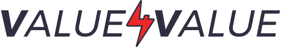

_Python doesn't byte_ è un progetto completamente open source, libero e gratuito. **L'informazione vuole essere libera** e accessibile a tutti, senza barriera alcuna. Credo fermamente in questo principio e penso che sia ancora più vero quanto si tratta dell'educazione, della conoscenza e della cultura. Per questo motivo, ho deciso di rendere disponibile tutto il materiale di questo libro in modo completamente gratuito.

Il mio lavoro, però, ha un costo. Oltre al tempo che dedico alla scrittura, allo studio delle tecnologie e alla creazione di contenuti, ci sono anche dei costi concreti da sostenere per mantenere il sito web e il dominio. Se ritieni che il mio lavoro sia utile e quindi abbia per te un valore, quello che ti chiedo è di restituire indietro un po' di questo valore. Questa è la filosofia del [Value 4 Value](https://value4value.info/about/), un concetto che ho conosciuto grazie alla banda di [Digitalia](https://digitalia.fm).

## Come restituire valore
Ci sono tre modi principali per restituire valore a questo progetto:

### Time
Il tempo è la risorsa più preziosa che abbiamo. Già solo il fatto che tu stia usando questo progetto per me ha un valore. Il primo modo con cui puoi restituire valore a questo progetto è donando una piccola parte del tuo tempo. Ci sono tanti modi per farlo. Potresti, ad esempio, parlare di questo progetto a qualcuno che conosci e che potrebbe averne bisogno o che per qualche motivo potrebbe essere interessato. Oppure, se hai trovato un errore, un refuso o un passaggio poco chiaro, potresti prenderti del tempo per segnalarmelo. Il tuo tempo sarà ben investito.

### Talent
Se hai delle competenze particolari, delle conoscenze o delle abilità che potrebbero essere utili per migliorare questo progetto, sarò felice di ascoltarti. Questo progetto è in continua evoluzione e c'è sempre spazio per migliorare. Se hai delle competenze tecniche e vuoi contribuire attivamente al progetto puoi iniziare da subito con una [pull request su GitHub](https://github.com/marcofarina/python-doesnt-byte/pulls). Ma non solo. Se hai delle competenze in design, comunicazione, marketing o in qualsiasi altro campo, sarò felice di ascoltarti e valutare insieme come poter collaborare.

### Treasure
Infine, valuta la possibilità di sostenere economicamente questo progetto. Anche una piccola donazione può fare la differenza tra un progetto che viene abbandonato e uno che viene sviluppato costantemente. Puoi farlo in diversi modi:
- **[Ko-fi](https://ko-fi.com/marcofarina)**: puoi offrirmi un caffè, un modo semplice e veloce per sostenere il progetto.
- **Bitcoin**: puoi inviare qualche satoshi:
    - on-chain all'indirizzo `bc1qhll2p0geaeqn4qskl2fk9gnlqusrcqja0v8p2d`;
    - via Lightning Network su [Alby](https://getalby.com/p/marcofarina).
