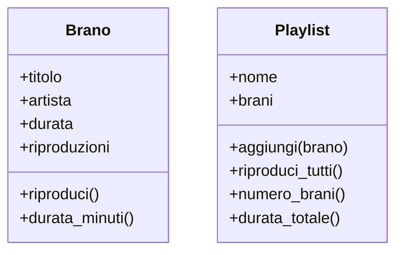

# Classi, istanze e metodi

> «Conosci te stesso.» — *Massima delfica (Tempio di Apollo a Delfi)*

Nella lezione precedente ti avevo chiesto di notare **una cosa sola**: i dati di un brano e ciò che sai farci vivono nello stesso blocco. Avevamo scritto una classe `Brano` e l'avevamo guardata da lontano, come si guarda un motore acceso senza aprire il cofano.

Oggi apriamo il cofano. Quella parola <InlineCode kind="keyword">class</InlineCode>, quel `self` che spuntava ovunque, quel `__init__` dall'aria criptica: smettono di essere magia e diventano tre meccanismi precisi che, una volta capiti, userai per il resto del volume. E lo facciamo continuando proprio da `Brano`, dandogli più comportamenti e affiancandogli la sua compagna naturale: la `Playlist` di **Risonanza**.

:::prereq

- La lezione precedente, *Perché gli oggetti?* — in particolare l'idea che un oggetto tiene insieme **dati** e **comportamento**
- Sintassi Python di base: variabili, tipi primitivi, condizionali, cicli
- Funzioni: definizione, parametri, valori di ritorno
- Liste: creazione, `append`, scorrerle con un ciclo `for`
- *f-string* per comporre messaggi (`f"{nome} dura {durata}s"`)

:::

:::learn

- Cosa fa il costruttore `__init__` e perché Python lo chiama **da solo** a ogni nuovo oggetto
- Chi è quel `self` che compare in ogni metodo, e perché *non* lo passi mai tu
- La differenza operativa tra **attributi** (lo stato, ciò che un oggetto *ha*) e **metodi** (il comportamento, ciò che *sa fare*)
- Come leggere e scrivere stato e comportamento con la **dot notation**
- Perché un'informazione che *dipende da altri dati* conviene **calcolarla**, non memorizzarla
- Le prime notazioni **UML** per disegnare una classe
- Le convenzioni di naming (PEP 8) per classi, attributi e metodi

:::

## Si riparte da Brano

Eccola di nuovo, la classe della scorsa lezione. Premi **Run**: non è cambiato niente, è il nostro punto di partenza.

```py live
class Brano:
    def __init__(self, titolo, artista, durata):
        self.titolo = titolo
        self.artista = artista
        self.durata = durata
        self.riproduzioni = 0

    def riproduci(self):
        self.riproduzioni += 1
        return f"▶  {self.titolo} — {self.artista}"


bohemian = Brano("Bohemian Rhapsody", "Queen", 354)
print(bohemian.riproduci())
print(f"Riproduzioni: {bohemian.riproduzioni}")
```

Cinque righe di definizione, e dopo possiamo creare quanti brani vogliamo. Ma *come* funziona? Tre domande, tre sezioni: `__init__`, `self`, e la coppia attributi/metodi.

## `__init__`: il costruttore

Quando scrivi `Brano("Bohemian Rhapsody", "Queen", 354)`, stai chiedendo a Python di **costruire** un nuovo oggetto. Ma un oggetto appena nato è una scatola vuota: come fa a sapere che il suo titolo è *Bohemian Rhapsody* e la sua durata 354 secondi? Glielo dice il <Tooltip def="Il metodo che Python chiama automaticamente alla creazione di ogni nuovo oggetto, per dargli uno stato iniziale. In Python si chiama sempre __init__.">costruttore</Tooltip>.

`__init__` (doppio underscore, *init*, doppio underscore — i programmatori lo pronunciano *dunder init*) è un metodo speciale con un solo compito: **inizializzare lo stato** di un oggetto appena creato. Non lo chiami mai tu esplicitamente — è Python a invocarlo, in automatico, ogni volta che istanzi la classe.

Vediamolo all'opera. Ho infilato un `print` dentro `__init__`: comparirà esattamente una volta per ogni brano che creo.

```py live
class Brano:
    def __init__(self, titolo, artista, durata):
        print(f"Sto costruendo: {titolo}")
        self.titolo = titolo
        self.artista = artista
        self.durata = durata
        self.riproduzioni = 0


bohemian = Brano("Bohemian Rhapsody", "Queen", 354)
blinding = Brano("Blinding Lights", "The Weeknd", 200)
bury = Brano("Bury a Friend", "Billie Eilish", 193)
```

Tre oggetti creati, tre stampe: `__init__` è scattato tre volte, una per brano. Nessuno l'ha chiamato a mano — è il prezzo che Python paga in automatico ogni volta che apre la parentesi su `Brano(...)`.

:::definition[Costruttore e istanziazione]

Il **costruttore** `__init__` è il metodo che porta un oggetto da "scatola vuota" a "oggetto pronto all'uso", assegnando i suoi valori iniziali. L'atto di creare un oggetto da una classe si chiama **istanziazione**: `Brano("...", "...", 354)` istanzia un nuovo `Brano`.

:::

## `self`: l'oggetto che conosce sé stesso

Hai notato che il primo parametro di `__init__` — e, vedremo, di *ogni* metodo — è `self`? Eppure quando crei un brano passi tre argomenti, non quattro:

```python
bohemian = Brano("Bohemian Rhapsody", "Queen", 354)  # 3 argomenti, non 4
```

Dove finisce `self`? Non lo passi tu: **lo passa Python**. `self` è il riferimento all'oggetto *specifico* che si sta costruendo o usando in quel momento. Dentro `__init__`, quando scrivi `self.titolo = titolo`, stai dicendo: *"attacca questo titolo a questo brano qui, non a un altro"*.

È letteralmente l'oggetto che conosce sé stesso — da cui la citazione in cima. Ogni `self.qualcosa` è un dato che l'oggetto porta con sé e a cui può sempre accedere.

La prova che ogni oggetto ha il *suo* `self`, indipendente dagli altri:

```py live
class Brano:
    def __init__(self, titolo, artista, durata):
        self.titolo = titolo
        self.artista = artista
        self.durata = durata
        self.riproduzioni = 0

    def riproduci(self):
        self.riproduzioni += 1
        return f"▶  {self.titolo} — {self.artista}"


bohemian = Brano("Bohemian Rhapsody", "Queen", 354)
bury = Brano("Bury a Friend", "Billie Eilish", 193)

# Ascolto Bohemian tre volte, Bury nemmeno una
bohemian.riproduci()
bohemian.riproduci()
bohemian.riproduci()

print(f"{bohemian.titolo}: {bohemian.riproduzioni} riproduzioni")
print(f"{bury.titolo}: {bury.riproduzioni} riproduzioni")
```

Dentro `riproduci`, `self` è `bohemian` quando lo chiami su `bohemian`, ed è `bury` quando lo chiami su `bury`. Per questo il contatore di uno non tocca quello dell'altro: `self.riproduzioni += 1` agisce sempre e solo sull'oggetto su cui hai chiamato il metodo.

:::code[Cosa succede davvero sotto il cofano]

Quando scrivi `bohemian.riproduci()`, Python lo traduce in `Brano.riproduci(bohemian)`: prende l'oggetto a sinistra del punto e lo infila come primo parametro, cioè `self`. Le due scritture sono equivalenti — provalo:

```py live
class Brano:
    def __init__(self, titolo, artista, durata):
        self.titolo = titolo
        self.artista = artista
        self.durata = durata
        self.riproduzioni = 0

    def riproduci(self):
        self.riproduzioni += 1
        return f"▶  {self.titolo} — {self.artista}"


bohemian = Brano("Bohemian Rhapsody", "Queen", 354)

print(bohemian.riproduci())          # come lo scrivi tu
print(Brano.riproduci(bohemian))     # come lo legge Python
print(f"Riproduzioni: {bohemian.riproduzioni}")  # 2: entrambe contano
```

Ecco perché `self` non lo passi mai a mano: lo mette l'interprete, prendendolo da ciò che sta a sinistra del punto.

:::

In altri linguaggi (Java, C++, JavaScript) questo riferimento esiste ma è implicito e si chiama `this`. Python ha scelto di renderlo esplicito: *explicit is better than implicit*, recita lo *Zen of Python*. Discutibile, ma è così, e dopo un po' ci si affeziona.

## Attributi e metodi: ciò che un oggetto *ha* e ciò che *sa fare*

Ora abbiamo il vocabolario per dare un nome ai due tipi di cose che vivono dentro una classe.

- Gli **attributi** sono le variabili attaccate a un oggetto: il suo **stato**, ciò che *ha*. Li crei nel costruttore con `self.qualcosa = ...` e ogni istanza ha la propria copia indipendente. In `Brano` sono `titolo`, `artista`, `durata`, `riproduzioni`.
- I **metodi** sono le funzioni definite dentro la classe: il **comportamento**, ciò che l'oggetto *sa fare*. Sono normali funzioni con due particolarità — vivono nella classe e il loro primo parametro è `self`. In `Brano` per ora c'è `riproduci`.

A entrambi accedi con la **dot notation**, la notazione col punto: `oggetto.attributo` per lo stato, `oggetto.metodo()` per il comportamento. La differenza è nelle parentesi.

```py live
class Brano:
    def __init__(self, titolo, artista, durata):
        self.titolo = titolo
        self.artista = artista
        self.durata = durata
        self.riproduzioni = 0

    def riproduci(self):
        self.riproduzioni += 1
        return f"▶  {self.titolo} — {self.artista}"


bohemian = Brano("Bohemian Rhapsody", "Queen", 354)

print(bohemian.titolo)        # leggo un attributo: niente parentesi
print(bohemian.riproduci())   # chiamo un metodo: servono le parentesi

bohemian.durata = 355         # scrivo un attributo dall'esterno
print(f"Durata aggiornata: {bohemian.durata}s")
```

Modificare un attributo direttamente dall'esterno (`bohemian.durata = 355`) Python lo permette, ma è una libertà di cui più avanti impareremo a diffidare: significa che chiunque, da qualunque punto del programma, può alterare lo stato di un oggetto scavalcando ogni controllo. Per ora ci basta sapere che la sintassi esiste; il modo di mettere dei paletti si chiama **incapsulamento**, e ha una lezione tutta sua.

### Un metodo che lavora lo stato

Un metodo non deve per forza *cambiare* l'oggetto: può anche limitarsi a leggerne lo stato e restituirne una versione più comoda. La durata di un brano la teniamo in secondi (354), ma a un essere umano «5:54» dice molto di più. Aggiungiamo un metodo che traduce:

```py live
class Brano:
    def __init__(self, titolo, artista, durata):
        self.titolo = titolo
        self.artista = artista
        self.durata = durata
        self.riproduzioni = 0

    def riproduci(self):
        self.riproduzioni += 1
        return f"▶  {self.titolo} — {self.artista}"

    def durata_minuti(self):
        minuti = self.durata // 60
        secondi = self.durata % 60
        return f"{minuti}:{secondi:02d}"


bohemian = Brano("Bohemian Rhapsody", "Queen", 354)
print(f"{bohemian.titolo} dura {bohemian.durata_minuti()}")
```

`durata_minuti` non aggiunge nessun nuovo dato: pesca da `self.durata` — l'unico dato vero — e ne ricava una forma leggibile al momento della chiamata. Tieni a mente questa idea del *"derivo invece di memorizzare"*: tra poco, con la `Playlist`, vedremo cosa succede a chi la ignora.

:::warning[I tre inciampi classici con self]

Quasi tutti, all'inizio, sbattono contro almeno uno di questi. Riconoscerli ti fa risparmiare ore.

**1. Dimenticare `self` tra i parametri del metodo**

```python
class Brano:
    def riproduci():               # ❌ manca self
        self.riproduzioni += 1     # NameError: name 'self' is not defined
```

Senza `self` tra i parametri, dentro il metodo non esiste alcun `self`: il metodo non sa su quale oggetto sta lavorando.

**2. Dimenticare il `self.` dentro il metodo**

```python
class Brano:
    def riproduci(self):
        riproduzioni += 1          # ❌ riproduzioni "nudo" è una variabile locale inesistente
```

`riproduzioni` da solo è una variabile locale; `self.riproduzioni` è l'attributo dell'oggetto. Due cose diverse: se vuoi lo stato, il `self.` non è opzionale.

**3. Sbagliare le parentesi**

```python
bohemian.titolo()      # ❌ titolo è un attributo, non una funzione: TypeError
bohemian.riproduci     # ❌ senza parentesi non esegui nulla: ottieni solo il riferimento al metodo
```

Regola mnemonica: gli attributi sono *cose che hai* (niente parentesi), i metodi sono *cose che fai* (parentesi).

:::

:::cleancode[PEP 8: come si chiamano le cose]

Python ha una guida di stile ufficiale, **PEP 8**, che fissa due convenzioni di naming da rispettare sempre — non per estetica, ma perché qualsiasi sviluppatore Python le dà per scontate e si confonde se le violi.

- **Classi** → `PascalCase` (ogni parola con l'iniziale maiuscola, attaccate): `Brano`, `Playlist`, `LettoreMusicale`. Una classe scritta `brano` sembra una variabile.
- **Attributi e metodi** → `snake_case` (minuscolo, parole separate da underscore): `durata`, `numero_brani`, `riproduci`, `durata_minuti`. Niente `numeroBrani` (è `camelCase`, roba da Java).
- **Bonus:** i metodi che rispondono sì/no iniziano con `is_`, `ha_`, `puo_`: si leggono come una domanda (`brano.is_preferito()`).

:::

## Una seconda classe: la Playlist

Una classe sola fa una vita triste. Risonanza non gestisce un brano alla volta: li raccoglie in **playlist**. E una playlist è un'ottima candidata a diventare un oggetto — ha uno stato (un nome, un elenco di brani) e dei comportamenti (aggiungere un brano, riprodurli tutti).

Nota la cosa interessante: gli attributi di `Playlist` non sono solo numeri e stringhe. Uno di essi, `brani`, è una **lista di oggetti `Brano`**. Un oggetto può contenere altri oggetti — è un'idea potente, si chiama **composizione**, e merita la sua lezione; qui ci serve solo come secondo banco di prova per `__init__`, `self`, attributi e metodi.

```py live
class Brano:
    def __init__(self, titolo, artista, durata):
        self.titolo = titolo
        self.artista = artista
        self.durata = durata
        self.riproduzioni = 0

    def riproduci(self):
        self.riproduzioni += 1
        return f"▶  {self.titolo} — {self.artista}"


class Playlist:
    def __init__(self, nome):
        self.nome = nome
        self.brani = []          # parte vuota: nessun brano all'inizio

    def aggiungi(self, brano):
        self.brani.append(brano)

    def riproduci_tutti(self):
        for brano in self.brani:
            print(brano.riproduci())


preferiti = Playlist("I miei preferiti")
preferiti.aggiungi(Brano("Bohemian Rhapsody", "Queen", 354))
preferiti.aggiungi(Brano("Bury a Friend", "Billie Eilish", 193))

print(f"Playlist: {preferiti.nome}")
preferiti.riproduci_tutti()
```

Guarda `riproduci_tutti`: scorre `self.brani` e su ciascun elemento chiama `brano.riproduci()`. Un oggetto `Playlist` che fa lavorare i suoi oggetti `Brano` — esattamente la collaborazione tra entità di cui parlavamo nella prima lezione.

### Predici l'output: l'attributo che si scollega

Ora la trappola promessa. Voglio sapere **quanti brani** contiene una playlist. Prima tentazione: lo salvo in un attributo `numero_brani`, lo parto da zero e lo incremento quando aggiungo. Senonché, scrivendo `aggiungi`, mi distraggo e lo dimentico.

Prima di premere Run, **predici l'output**: cosa stamperà l'ultima riga?

```py live
class Brano:
    def __init__(self, titolo, artista, durata):
        self.titolo = titolo
        self.durata = durata


class PlaylistFragile:
    def __init__(self, nome):
        self.nome = nome
        self.brani = []
        self.numero_brani = 0        # lo salvo qui...

    def aggiungi(self, brano):
        self.brani.append(brano)
        # ...e qui mi sono scordato di fare self.numero_brani += 1


p = PlaylistFragile("Workout")
p.aggiungi(Brano("Blinding Lights", "The Weeknd", 200))
p.aggiungi(Brano("Bury a Friend", "Billie Eilish", 193))

print(f"Brani in lista: {len(p.brani)}")        # quanti ce ne sono davvero
print(f"numero_brani dice: {p.numero_brani}")   # cosa dice l'attributo
```

`len(p.brani)` dice 2, ma `numero_brani` è ancora fermo a 0. Avevo **due fonti di verità** per lo stesso fatto — la lista e il contatore — e bastava dimenticare un aggiornamento perché divergessero. È un bug subdolo (ha pure un nome da convegno: *state desynchronization*) ed è esattamente parente del bug silenzioso delle liste parallele della scorsa lezione.

La cura è la stessa idea di `durata_minuti`: **non memorizzare ciò che puoi derivare**. Il numero di brani *è già* dentro la lista — basta contarli quando serve.

```py live
class Brano:
    def __init__(self, titolo, durata):
        self.titolo = titolo
        self.durata = durata


class Playlist:
    def __init__(self, nome):
        self.nome = nome
        self.brani = []

    def aggiungi(self, brano):
        self.brani.append(brano)

    def numero_brani(self):
        return len(self.brani)

    def durata_totale(self):
        totale = 0
        for brano in self.brani:
            totale += brano.durata
        return totale


p = Playlist("Workout")
p.aggiungi(Brano("Blinding Lights", 200))
p.aggiungi(Brano("Bury a Friend", 193))

print(f"Brani: {p.numero_brani()}")
print(f"Durata totale: {p.durata_totale()}s")
```

`numero_brani` e `durata_totale` non possono più mentire: ogni volta ripartono dall'unica fonte di verità, la lista `self.brani`. Aggiungi un brano e i conti tornano da soli, senza che tu debba ricordarti nulla.

:::cleancode[Una sola fonte di verità]

Se un'informazione **dipende** da un'altra (il numero di brani dipende dalla lista, i minuti dipendono dai secondi), tienine **una** sola come dato e **calcola** l'altra al volo. Due copie dello stesso fatto prima o poi si scollegano — ed è sempre nel momento peggiore. *(Più avanti, con `@property`, vedremo come far sembrare un attributo un calcolo del genere, così potrai scrivere `p.numero_brani` senza parentesi. Ma è il prossimo passo: per ora, un metodo.)*

:::

## Disegnare una classe: prime notazioni UML

Quando i programmatori si scambiano idee sulle classi, non si copiano addosso il codice: disegnano. La notazione standard si chiama **UML** (*Unified Modeling Language*), e per le classi usa una scatola a **tre scomparti**: il nome in alto, gli attributi (lo stato) in mezzo, i metodi (il comportamento) in basso. Il `+` davanti significa "visibile dall'esterno" (pubblico).



Leggi la scatola e hai già in testa la classe: cosa sa di sé (lo scomparto centrale) e cosa sa fare (quello in basso). I metodi si riconoscono dalle parentesi, esattamente come nel codice. Una `Playlist` però *contiene* dei `Brano`: quel legame — la freccia che unisce le due scatole — è il cuore della lezione sulle **relazioni UML**, dove imparerai a disegnare anche il filo tra gli oggetti, non solo gli oggetti.

:::info[Nel codice vero: una classe per file]

Qui teniamo `Brano` e `Playlist` nella stessa cella perché devono girare insieme in pagina. In un progetto reale la convenzione è **una classe (o poche, strettamente legate) per file**: `brano.py`, `playlist.py`, e un `main.py` che le importa con `from brano import Brano`. Ogni file diventa un'unità riusabile — copi `brano.py` in un altro progetto e funziona, senza pescare le righe giuste da un papocchio di ottocento linee.

:::

:::nutshell

- Il **costruttore** `__init__` inizializza lo stato di un oggetto e Python lo chiama **da solo** a ogni istanziazione.
- `self` è il riferimento all'oggetto su cui un metodo opera: non lo passi tu, lo mette Python prendendolo da ciò che sta a sinistra del punto. `oggetto.metodo()` è `Classe.metodo(oggetto)`.
- Gli **attributi** sono lo stato (ciò che un oggetto *ha*), i **metodi** sono il comportamento (ciò che *sa fare*). Vi accedi con la **dot notation**: attributi senza parentesi, metodi con.
- Se un'informazione dipende da altri dati, **calcolala** invece di memorizzarla: due fonti di verità prima o poi si scollegano.
- L'**UML** disegna una classe come scatola a tre scomparti: nome, attributi, metodi.
- PEP 8: classi in `PascalCase`, attributi e metodi in `snake_case`.

:::

<QuizDeck>

<Quiz>
  <QuizQuestion>
    Scrivi `bohemian = Brano("Bohemian Rhapsody", "Queen", 354)`. Passi **tre** argomenti, ma `__init__` ha **quattro** parametri (`self, titolo, artista, durata`). Perché non è un errore?
  </QuizQuestion>

  <QuizOption>
    Perché `self` ha un valore di default, quindi è opzionale.
    <QuizFeedback>
      No: `self` non ha alcun default. È diverso — non lo passi proprio tu.
    </QuizFeedback>
  </QuizOption>

  <QuizOption correct>
    Perché `self` lo fornisce Python in automatico: è il nuovo oggetto in costruzione, infilato come primo parametro.
    <QuizFeedback>
      Esatto. `Brano(...)` crea l'oggetto e lo passa come `self`; tu fornisci solo gli argomenti che vengono dopo. Vale per ogni metodo, non solo per `__init__`.
    </QuizFeedback>
  </QuizOption>

  <QuizOption>
    Perché `durata` è numerico e Python lo conta come due parametri.
    <QuizFeedback>
      No, il tipo del valore non c'entra con il conteggio dei parametri.
    </QuizFeedback>
  </QuizOption>

  <QuizOption>
    Perché in realtà l'ultimo argomento viene ignorato.
    <QuizFeedback>
      No: tutti e tre gli argomenti finiscono in attributi (`titolo`, `artista`, `durata`). Nessuno viene buttato.
    </QuizFeedback>
  </QuizOption>
</Quiz>

<Quiz>
  <QuizQuestion>
    Vuoi sapere quanti brani ci sono in una `Playlist`. Qual è l'approccio più robusto?
  </QuizQuestion>

  <QuizOption>
    Salvare un attributo `numero_brani` e ricordarsi di incrementarlo in ogni metodo che modifica la lista.
    <QuizFeedback>
      È proprio la trappola della sezione "predici l'output": basta dimenticare un aggiornamento e l'attributo si scollega dalla realtà. Due fonti di verità che divergono.
    </QuizFeedback>
  </QuizOption>

  <QuizOption correct>
    Un metodo che restituisce `len(self.brani)`, calcolando il valore al momento dalla lista.
    <QuizFeedback>
      Esatto. La lista `self.brani` è l'unica fonte di verità; il conteggio si deriva da lì e non può mai essere incoerente.
    </QuizFeedback>
  </QuizOption>

  <QuizOption>
    Contare i brani a mano e scrivere il numero come commento nel codice.
    <QuizFeedback>
      Un commento non è eseguibile e invecchia all'istante: alla prima modifica è già falso. Serve un valore calcolato dal codice.
    </QuizFeedback>
  </QuizOption>

  <QuizOption>
    Creare una seconda lista parallela con i numeri progressivi dei brani.
    <QuizFeedback>
      Liste parallele: il bug della prima lezione, in incognito. Più strutture da tenere allineate a mano significa più modi di sbagliare.
    </QuizFeedback>
  </QuizOption>
</Quiz>

</QuizDeck>

:::tip[Per andare oltre]

Hai visto come un singolo oggetto nasce (`__init__`), conosce sé stesso (`self`) e agisce (i metodi). La prossima lezione fa un passo di lato: e se un'informazione riguardasse **tutti** i brani insieme, non un brano in particolare — per esempio *quanti brani sono stati creati in totale*? Lì entrano in scena gli **attributi di classe** e i **metodi di classe e statici**: roba che appartiene allo stampo, non al singolo biscotto.

Nel frattempo, un allenamento senza codice: pensa alla `Playlist` e prova a immaginare altri tre comportamenti che dovrebbe sapere fare (rimuovere un brano? trovare il più ascoltato? mescolarsi?). Per ciascuno, chiediti: *di quali attributi ha bisogno per funzionare?* È esattamente il ragionamento con cui si progetta una classe prima ancora di scriverla.

:::
