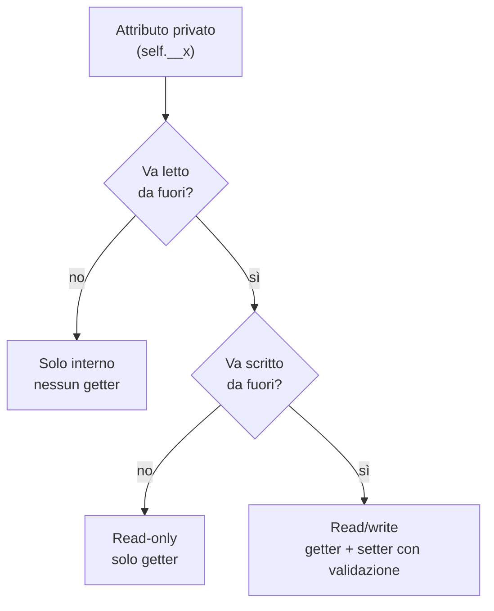
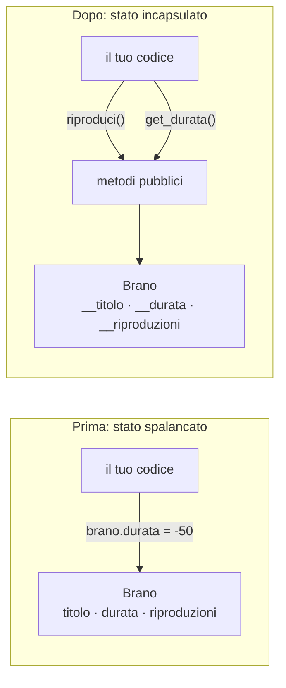

# Incapsulamento

<Epigraph author="Gandalf — Il Signore degli Anelli, J.R.R. Tolkien">

Keep it secret. Keep it safe.

</Epigraph>

Alla fine della scorsa lezione ti ho lasciato con una falla. I nostri brani ora si raccontano bene con `__str__` e `__repr__`, ma sono indifesi: chiunque, da qualunque punto del programma, può scrivere `bohemian.durata = -50` e darci un brano che dura meno di zero secondi. L'oggetto incassa il colpo senza fiatare.

Questa è esattamente la situazione che Gandalf vorrebbe evitare. Lo stato di un oggetto — i suoi dati interni — è come l'Anello: alcune cose è meglio tenerle nascoste e protette, non lasciarle in mano al primo che passa. Oggi insegniamo ai nostri oggetti a **difendere il proprio stato**: cosa lasciar vedere, cosa lasciar toccare, e cosa chiudere a chiave.

:::prereq

- La lezione precedente, _Mostrare un oggetto_ — in particolare `self`, gli attributi d'istanza e i metodi speciali `__str__` / `__repr__`
- Sapere scrivere un `__init__` e creare istanze di una classe
- La differenza tra **leggere** un attributo (`brano.durata`) e **scriverci** sopra (`brano.durata = ...`)

:::

:::learn

- Cos'è l'**incapsulamento** e perché lasciare gli attributi aperti a chiunque è una pessima idea
- La differenza tra l'**interfaccia pubblica** e lo **stato interno** di un oggetto
- Le convenzioni Python `_` (un underscore) e `__` (due underscore), e cosa fa davvero il <Tooltip def="Da to mangle, storpiare. Python riscrive internamente il nome di un attributo __x in _NomeClasse__x.">**name mangling**</Tooltip>
- Quando scrivere **getter** e **setter** espliciti — e quando sono solo cerimonia inutile
- Il principio **tell, don't ask**: dire all'oggetto cosa fare, invece di interrogarlo e decidere al posto suo

:::

## Lo stato spalancato

Partiamo dal problema, in concreto. Ecco il `Brano` come lo conosciamo, con i suoi attributi pubblici. **Predici l'output** prima di premere **Run**: cosa succede quando assegniamo valori assurdi?

```py live
class Brano:
    def __init__(self, titolo, artista, durata):
        self.titolo = titolo
        self.artista = artista
        self.durata = durata


bohemian = Brano("Bohemian Rhapsody", "Queen", 354)

bohemian.durata = -50            # una durata negativa?
bohemian.artista = 42            # un artista che è un numero?

print(f"{bohemian.titolo}: {bohemian.durata}s, di {bohemian.artista}")
```

Nessun errore. Python esegue tutto con la faccia impassibile di chi non vuole problemi: accetta una durata negativa, accetta un numero al posto del nome dell'artista, e ti consegna un brano che non ha alcun senso. Il guaio è che l'esplosione arriverà più tardi — venti righe dopo, quando qualcuno proverà a sommare le durate della playlist e si ritroverà un totale più corto del previsto, senza capire perché. Lo stato dell'oggetto è **spalancato**, e nessuno fa la guardia.

## Cosa significa incapsulare

**Incapsulare** vuol dire, letteralmente, mettere in una capsula. Nell'OOP significa raggruppare dati e comportamento in un oggetto e — soprattutto — decidere **cosa è visibile dall'esterno** e **cosa resta affare interno**.

Ogni oggetto ben fatto ha due facce:

- L'**interfaccia pubblica**: i metodi e gli attributi che il mondo esterno può legittimamente usare. È il contratto che la classe offre. «Puoi chiedermi di riprodurmi, puoi leggermi il titolo, puoi votarmi da 1 a 5.»
- Lo **stato interno**: le variabili che servono a far funzionare la classe ma che non riguardano chi sta fuori. È il «come funziona dentro», non il «cosa puoi fare con me».

:::definition[Interfaccia e implementazione]

L'**interfaccia** è ciò che la classe promette al mondo: i metodi e gli attributi accessibili dall'esterno. L'**implementazione** è come la classe mantiene quella promessa: strutture dati, contatori, calcoli intermedi. La regola d'oro, vecchia di trent'anni e mai smentita: _programma verso l'interfaccia, non verso l'implementazione_. Finché il contratto pubblico resta lo stesso, lo stato interno può essere riscritto da capo senza che nessuno fuori se ne accorga.

:::

## Le convenzioni: `_` e `__`

Diversamente da Java o C++, Python non ha le parole chiave `private` e `public`. La sua filosofia è «siamo tutti adulti consenzienti»: il linguaggio non ti impedisce nulla, si limita a _segnalare_ l'intenzione con il nome dell'attributo. Le convenzioni sono due, di severità crescente:

- **Un underscore** (`_durata`): «convenzionalmente privato». Un cartello: _questo è un dettaglio interno, non toccarlo se non sai cosa fai_. Python non ti ferma; ti guarda male.
- **Due underscore** (`__durata`): «fortemente privato». Qui Python attiva il **name mangling** e rende l'accesso dall'esterno effettivamente scomodo.

In questa lezione usiamo il **doppio underscore**, perché il meccanismo che attiva è il più istruttivo da vedere. Nella prossima lezione, con le `@property`, scopriremo perché nel codice Python reale si preferisce spesso il singolo underscore.

### Cosa fa il name mangling

Quando Python incontra un attributo che inizia con due underscore (e **non** finisce con due underscore — quelli sono i _dunder_, tutt'altra cosa), ne riscrive il nome internamente in `_NomeClasse__attributo`. Una rietichettatura automatica. Prova: questo blocco solleva un errore di proposito — **predici quale riga lo causa**.

```py live
class Brano:
    def __init__(self, titolo, artista, durata):
        self.__titolo = titolo
        self.__artista = artista
        self.__durata = max(0, durata)     # niente durate negative, già qui


bohemian = Brano("Bohemian Rhapsody", "Queen", 354)

print(bohemian._Brano__durata)    # 354 — il nome "storpiato" funziona
print(bohemian.__durata)          # AttributeError: l'attributo "nudo" non esiste
```

L'attributo non è davvero inaccessibile: chiunque sia disposto a scrivere `_Brano__durata` può raggiungerlo. Ma è abbastanza brutto da scoraggiare l'accesso accidentale e da far capire a chi legge che sta forzando qualcosa che non dovrebbe.

:::warning[La trappola subdola dell'assegnazione]

C'è un comportamento che merita un avviso al neon. Leggere `bohemian.__durata` fallisce, l'abbiamo visto. Ma **scriverci** sopra sembra funzionare:

```python
bohemian.__durata = 9999
print(bohemian.__durata)    # 9999 — sembra aver funzionato!
```

Non è così. Python non ha toccato l'attributo privato: ha **creato un attributo pubblico nuovo di zecca** sull'istanza, che si chiama _casualmente_ `__durata`. Il vero stato, `_Brano__durata`, è ancora lì intatto con il suo 354. Tu hai solo aggiunto un attributo-spazzatura scollegato da tutto, mentre i metodi della classe continuano a usare il valore vero. È il motivo per cui con gli oggetti incapsulati si interagisce **sempre attraverso metodi pubblici**, mai assegnando attributi a caso dall'esterno.

:::

:::history[Perché «name mangling»]

Lo scopo originale del doppio underscore non era la privacy, ma evitare **collisioni di nomi** nell'ereditarietà: se una classe ha `__x` e una sua sottoclasse pure, diventano `_Base__x` e `_Sotto__x`, due attributi distinti che non si pestano i piedi. È un dettaglio che tornerà quando parleremo di ereditarietà, più avanti nel volume.

:::

## Getter: leggere lo stato protetto

Ora che gli attributi sono privati, serve un modo controllato per leggerli dall'esterno: un **getter**, un metodo pubblico il cui scopo è restituire un attributo privato. Per convenzione si chiama `get_qualcosa`.

```py live
class Brano:
    def __init__(self, titolo, artista, durata):
        self.__titolo = titolo
        self.__artista = artista
        self.__durata = max(0, durata)
        self.__riproduzioni = 0

    def get_titolo(self):
        return self.__titolo

    def get_durata(self):
        return self.__durata

    def get_riproduzioni(self):
        return self.__riproduzioni


bohemian = Brano("Bohemian Rhapsody", "Queen", 354)

print(bohemian.get_titolo())        # Bohemian Rhapsody
print(bohemian.get_durata())        # 354
bohemian.durata = -50               # crea spazzatura, NON tocca lo stato vero
print(bohemian.get_durata())        # 354 — lo stato è al sicuro
```

Quella riga `bohemian.durata = -50` ora non fa più danni: crea un attributo-spazzatura che nessun metodo guarderà mai. Il `get_durata()` continua a restituire il valore vero, blindato dentro `__durata`. La falla con cui abbiamo aperto la lezione è chiusa.

## Setter: scrivere con validazione

A volte un attributo deve poter cambiare _anche_ dall'esterno — ma in modo controllato. Per questo serve un **setter**: un metodo che modifica un attributo privato dopo aver **validato** l'input. Aggiungiamo a `Brano` una valutazione a stelle, da 1 a 5.

```py live
class Brano:
    def __init__(self, titolo, artista, durata):
        self.__titolo = titolo
        self.__durata = max(0, durata)
        self.__valutazione = None        # non ancora votato

    def get_valutazione(self):
        return self.__valutazione

    def set_valutazione(self, stelle):
        if not isinstance(stelle, int):
            print(f"Voto ignorato: servono stelle intere, non {type(stelle).__name__}.")
            return
        if stelle < 1 or stelle > 5:
            print(f"Voto {stelle} fuori scala: ammessi 1-5. Ignorato.")
            return
        self.__valutazione = stelle


bohemian = Brano("Bohemian Rhapsody", "Queen", 354)

bohemian.set_valutazione(11)        # fuori scala: rifiutato
bohemian.set_valutazione("cinque")  # tipo sbagliato: rifiutato
bohemian.set_valutazione(5)         # ok
print(bohemian.get_valutazione())   # 5
```

Prova a passare valori assurdi: il setter intercetta, valida e rifiuta. Lo stato dell'oggetto resta **sempre** coerente — un brano non avrà mai una valutazione di 11 stelle o della stringa `"cinque"`. Questa è la promessa che l'incapsulamento permette di mantenere.

:::cleancode[Non scrivere getter e setter per ogni attributo]

La tentazione del principiante illuminato: «ora che ho capito, scrivo `get_` e `set_` per _tutti_ gli attributi di _tutte_ le classi». Risultato: classi con quaranta metodi banali che fanno solo `return self.__x`, e la sensazione che l'OOP sia un complotto contro la produttività. Chiediti, attributo per attributo:

- **Va letto da fuori?** Se no, niente getter.
- **Va scritto da fuori?** Se no, niente setter.
- **La scrittura richiede validazione o logica?** Se sì, il setter si guadagna il posto. Se si limita a `self.__x = value`, è solo rumore: tanto vale lasciare l'attributo pubblico.

In Python, per i casi semplici, esistono le `@property` (prossima lezione) che eliminano del tutto questa cerimonia. Lo scopo non è «avere tanti metodi», è «avere il giusto livello di controllo».

:::

## Tre livelli di visibilità

Combinando attributi privati con la presenza o l'assenza di getter e setter, ogni attributo ricade in una di tre categorie. Sceglierla è una delle decisioni di design più importanti quando scrivi una classe.



- **Solo interno** — né getter né setter. Dati di servizio che riguardano solo la logica interna: un buffer, un contatore privato, un timestamp dell'ultima riproduzione. Il mondo esterno non sa nemmeno che esistono.
- **Read-only** — solo il getter. Identità e dati fissati alla nascita: `titolo`, `artista`, `durata`. Un brano non si rinomina a metà ascolto e non cambia durata: leggerli ha senso, scriverli no.
- **Read/write controllato** — getter e setter con validazione. Stato che può legittimamente cambiare durante la vita dell'oggetto, come la valutazione: leggibile e modificabile, ma solo entro regole precise.

## Tell, don't ask

Getter e setter portano con sé un rischio sottile: scrivere codice «interrogativo», in cui chi usa l'oggetto chiede i dati, ci ragiona sopra e rispedisce dentro il risultato. Vogliamo contare un ascolto di `bohemian`. In stile «ask»:

```python
# Stile "ask": leggo, calcolo fuori, riscrivo dentro
attuali = bohemian.get_riproduzioni()
bohemian.set_riproduzioni(attuali + 1)
```

Funziona, ma c'è qualcosa che non va: la logica «riprodurre significa +1 ascolto» vive **fuori** dal brano, in chi lo usa. Il `Brano` è trattato come un sacco di variabili da cui pescare e su cui riscrivere — esattamente la situazione di partenza, solo con due passi di cerimonia in più. Il principio che mette ordine si chiama **tell, don't ask** (_dì, non chiedere_): invece di interrogare l'oggetto per agire sui suoi dati da fuori, **dici** all'oggetto cosa fare, e la logica resta dentro la classe che possiede lo stato.

```py live
class Brano:
    def __init__(self, titolo, artista, durata):
        self.__titolo = titolo
        self.__artista = artista
        self.__durata = max(0, durata)
        self.__riproduzioni = 0

    def get_riproduzioni(self):
        return self.__riproduzioni

    def riproduci(self):
        self.__riproduzioni += 1

    def __str__(self):
        return f"{self.__titolo} — {self.__artista}"


bohemian = Brano("Bohemian Rhapsody", "Queen", 354)

bohemian.riproduci()
bohemian.riproduci()
bohemian.riproduci()

print(f"{bohemian} ascoltato {bohemian.get_riproduzioni()} volte")
```

Nota che `__riproduzioni` ha un getter ma **nessun setter**: dall'esterno lo si può leggere, ma l'unico modo per farlo crescere è `riproduci()`. Nessuno può falsificare il conteggio degli ascolti scrivendolo a mano. E se domani la regola cambia — un ascolto sotto i 30 secondi non conta, oppure ogni riproduzione aggiorna anche un timestamp — modifichi **un solo posto**, dentro `riproduci()`, e tutto il resto del programma resta felicemente all'oscuro.

:::cleancode[Tell, don't ask & Law of Demeter]

Due regole imparentate, entrambe sul «non mettere il naso nelle cose altrui»:

- **Tell, don't ask** — dì all'oggetto cosa fare con metodi che esprimono l'**intenzione** (`riproduci()`, `vota(5)`), non chiedere i suoi dati per decidere al posto suo. Anche il nostro `set_valutazione` sarebbe più espressivo come `vota(stelle)`.
- **Law of Demeter** — parla solo con i tuoi _vicini diretti_. Evita le catene tipo `lettore.playlist_corrente.brani[0].get_durata()`: ogni punto in più è una dipendenza in più dalla struttura interna altrui. Meglio che il lettore esponga `durata_brano_corrente()` e tenga i suoi affari per sé.

:::

:::cleancode[Una classe, una responsabilità (SRP)]

Più una classe nasconde, più è libera di cambiare dentro senza rompere nulla fuori. Ma c'è un'altra domanda da farsi: _quante ragioni ha questa classe per cambiare?_ Il **Single Responsibility Principle** dice: una sola. Il nostro `Brano` modella un brano — i suoi dati e i comportamenti che lo riguardano. Non deve anche salvarsi su file, né stampare a schermo la grafica del player, né scaricare la copertina dal web. Quelle sono altre responsabilità, di altre classi. Se ti accorgi che una classe cambia «un po' quando cambia il formato del file _e_ un po' quando cambia la grafica», stai tenendo insieme cose che andrebbero separate.

:::

## Prima e dopo



Nel «prima» il codice cliente parla direttamente con lo stato, e può corromperlo. Nel «dopo» ogni accesso passa per un metodo, che può controllare, validare, registrare. L'oggetto smette di essere un sacco di variabili e diventa un'entità con un _contratto_. Esattamente quello che Gandalf consiglierebbe: ciò che conta, tienilo segreto e al sicuro.

:::nutshell

- L'**incapsulamento** separa l'**interfaccia pubblica** (cosa puoi fare con l'oggetto) dallo **stato interno** (come funziona dentro).
- In Python `_x` segnala «privato per convenzione»; `__x` attiva il **name mangling** (`_Classe__x`) e rende l'accesso dall'esterno scomodo.
- Assegnare `obj.__x = ...` da fuori **non** modifica l'attributo privato: crea un attributo-spazzatura scollegato.
- Un **getter** restituisce un attributo privato; un **setter** lo modifica **dopo aver validato**. Un setter senza validazione è solo rumore.
- Tre livelli di visibilità: **solo interno**, **read-only** (solo getter), **read/write controllato** (getter + setter).
- **Tell, don't ask**: dì all'oggetto cosa fare con metodi semantici (`riproduci()`), non interrogarlo e decidere al posto suo.
- Parti da **tutto privato**; apri uno spiraglio solo quando un caso d'uso reale lo chiede.

:::

<QuizDeck>

<Quiz>
  <QuizQuestion>
    Hai un attributo privato `self.__durata`. Dall'esterno scrivi `brano.__durata = 9999`. Cosa succede?
  </QuizQuestion>

<QuizOption>
  Modifichi la durata dell'oggetto: ora vale 9999.
  <QuizFeedback>
    No: il vero attributo è `_Brano__durata`, e resta intatto. Stai creando un
    attributo pubblico nuovo che si chiama solo *casualmente* `__durata`.
  </QuizFeedback>
</QuizOption>

<QuizOption correct>
  Crei un attributo-spazzatura nuovo; il vero `_Brano__durata` resta intatto.
  <QuizFeedback>
    Esatto. Il name mangling agisce sui nomi che la classe definisce: una
    scrittura dall'esterno non lo trova e finisce per creare un attributo
    separato, scollegato dai metodi della classe. È la trappola subdola
    dell'assegnazione.
  </QuizFeedback>
</QuizOption>

<QuizOption>
  Solleva un `AttributeError`, perché l'attributo è privato.
  <QuizFeedback>
    No: in *lettura* `brano.__durata` fallisce, ma in *scrittura* Python non si
    oppone — anzi, crea silenziosamente un nuovo attributo. È proprio questo a
    renderlo insidioso.
  </QuizFeedback>
</QuizOption>

  <QuizOption>
    Niente: l'assegnazione viene ignorata perché l'attributo è protetto.
    <QuizFeedback>
      No: Python non ignora nulla. L'assegnazione va a buon fine, ma crea un attributo diverso da quello che credi. L'oggetto continua a usare il valore vero.
    </QuizFeedback>
  </QuizOption>
</Quiz>

<Quiz>
  <QuizQuestion>
    L'attributo `__riproduzioni` ha un `get_riproduzioni()` ma **nessun** setter pubblico: lo si aggiorna solo con `riproduci()`. Perché è una buona scelta?
  </QuizQuestion>

<QuizOption>
  Perché così il conteggio degli ascolti si può solo leggere, mai aumentare.
  <QuizFeedback>
    No: il conteggio *può* aumentare, ma solo nell'unico modo legittimo —
    chiamando `riproduci()`. È diverso da «non si può modificare».
  </QuizFeedback>
</QuizOption>

<QuizOption correct>
  Perché nessuno può falsificare il conteggio da fuori, e la regola «un ascolto
  = +1» vive in un solo posto.
  <QuizFeedback>
    Esatto. È tell, don't ask: lo stato cambia solo attraverso un metodo che
    esprime l'intenzione. Se domani la regola si complica, modifichi solo
    `riproduci()` e il resto del codice non se ne accorge.
  </QuizFeedback>
</QuizOption>

<QuizOption>
  Perché i getter sono più veloci dei setter.
  <QuizFeedback>
    No: la performance non c'entra. Il punto è il *controllo* su come e quando
    lo stato cambia.
  </QuizFeedback>
</QuizOption>

  <QuizOption>
    Perché senza setter l'attributo diventa automaticamente read-only anche dall'interno della classe.
    <QuizFeedback>
      No: dentro la classe puoi sempre scrivere `self.__riproduzioni`. Il punto è chiudere la scrittura *dall'esterno*, lasciandola passare solo da metodi semantici.
    </QuizFeedback>
  </QuizOption>
</Quiz>

<Quiz>
  <QuizQuestion>
    Quale di questi setter **si guadagna il posto**, invece di essere solo cerimonia inutile?
  </QuizQuestion>

<QuizOption>
  `def set_titolo(self, t): self.__titolo = t`
  <QuizFeedback>
    No: si limita a copiare il valore, senza alcun controllo. Equivale a
    lasciare l'attributo pubblico, con due righe in più. Inutile — e per di più
    il titolo di un brano è un dato d'identità: meglio read-only.
  </QuizFeedback>
</QuizOption>

<QuizOption correct>
  `def set_valutazione(self, s):` con dentro i controlli su tipo e intervallo
  1-5
  <QuizFeedback>
    Esatto. Questo setter *valida*: rifiuta i tipi sbagliati e i valori fuori
    scala, garantendo che l'oggetto resti sempre in uno stato coerente. È
    esattamente ciò che giustifica l'esistenza di un setter.
  </QuizFeedback>
</QuizOption>

<QuizOption>
  `def set_durata(self, d): self.__durata = d`
  <QuizFeedback>
    No: nessuna validazione, quindi nessun valore aggiunto — e per giunta riapre
    la falla della durata negativa che abbiamo appena chiuso. La durata è un
    dato fisso: read-only.
  </QuizFeedback>
</QuizOption>

  <QuizOption>
    `def get_riproduzioni(self): return self.__riproduzioni`
    <QuizFeedback>
      Attenzione: questo è un *getter*, non un setter. Legge soltanto, non modifica nulla. La domanda chiedeva quale setter sia giustificato.
    </QuizFeedback>
  </QuizOption>
</Quiz>

</QuizDeck>

:::tip[Per andare oltre]

Hai notato l'attrito? Per leggere la valutazione scrivi `bohemian.get_valutazione()`, non più il comodo `bohemian.valutazione`. L'incapsulamento ci ha resi più sicuri ma più verbosi: ogni accesso è diventato una chiamata di metodo con le parentesi. In altri linguaggi questo è il prezzo da pagare. In Python no.

La prossima lezione apre la porta alle `@property`: un modo per avere la sintassi pulita dell'attributo pubblico (`bohemian.valutazione`) e, dietro le quinte, tutta la validazione di un setter. Il meglio dei due mondi — e il motivo per cui, nel codice Python reale, il doppio underscore lascia spesso il posto al singolo.

Nel frattempo, un esercizio senza fretta: riprendi la `Playlist` immaginata nelle scorse lezioni. Rendi privata la lista dei brani (`__brani`), esponi un metodo `aggiungi(brano)` (tell, don't ask) e un `get_durata_totale()` che somma le durate. Poi chiediti: serve un getter che restituisca l'intera lista? E se lo restituisci, chi la riceve può modificarla scavalcando il tuo `aggiungi`?

:::
