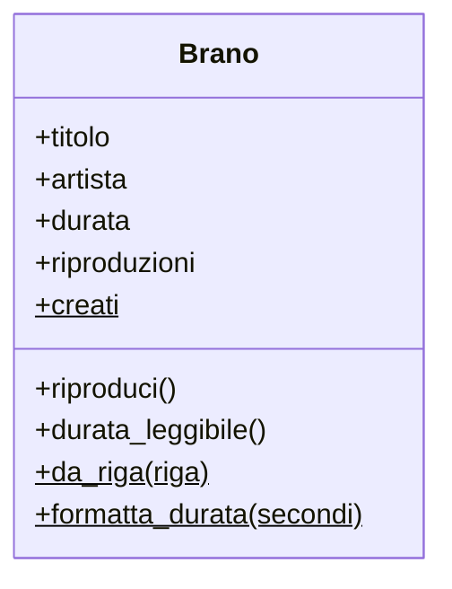

# Metodi di classe e statici

<Epigraph author="Tim Peters, lo Zen di Python">

Namespaces are one honking great idea — let's do more of those!

</Epigraph>

Alla fine della scorsa lezione ti ho lasciato con una domanda apparentemente innocua: *quanti brani ho creato in totale?* Non quanti ne contiene una certa playlist — quelli li sai già contare — ma quanti oggetti `Brano` sono nati da quando il programma è partito. È una domanda strana, perché la risposta non appartiene a **nessun** brano in particolare: *Bohemian Rhapsody* non sa nulla di *Blinding Lights*, e non deve saperlo.

Finora ogni cosa che abbiamo scritto viveva dentro un oggetto, raggiunta tramite `self`. Oggi scopriamo che esiste un altro piano: ci sono dati e comportamenti che appartengono allo **stampo** — alla classe stessa — e non al singolo biscotto sfornato. È un piano che userai meno spesso di `self`, ma quando serve non c'è alternativa pulita.

:::prereq

- La lezione precedente, *Classi, istanze e metodi* — in particolare `__init__`, `self`, la differenza tra attributi e metodi e la dot notation
- Funzioni: definizione, parametri, valori di ritorno
- Liste e dizionari: `append`, accesso per chiave
- Lo *split* di una stringa (`"a;b;c".split(";")`) — ci servirà per un costruttore alternativo
- *f-string* per comporre messaggi

:::

:::learn

- La differenza tra **attributo di istanza** (uno per oggetto) e **attributo di classe** (uno solo, condiviso dallo stampo)
- Come tenere un'informazione che riguarda *tutti* gli oggetti, per esempio quanti ne sono stati creati
- Il trabocchetto degli attributi di classe **mutabili** (la lista condivisa per sbaglio)
- Cos'è un **metodo di classe** (`@classmethod`) e chi è quel `cls`
- I **costruttori alternativi**: tante strade diverse per creare lo stesso tipo di oggetto (il seme del pattern *Factory*)
- Cos'è un **metodo statico** (`@staticmethod`) e quando una funzione "appartiene" a una classe pur non usandone lo stato
- Come scegliere tra metodo d'istanza, di classe e statico — e quando, invece, ti basta una funzione

:::

## La domanda che nessun brano sa rispondere

Proviamo la strada ingenua. Voglio un contatore dei brani creati: lo metto in una variabile e lo incremento dentro `__init__`. Dove? Fuori dalla classe, come variabile globale — sembra l'unico posto possibile.

```py live
contatore_brani = 0          # una variabile globale, fuori dalla classe

class Brano:
    def __init__(self, titolo, artista, durata):
        global contatore_brani
        contatore_brani += 1
        self.titolo = titolo
        self.artista = artista
        self.durata = durata


Brano("Bohemian Rhapsody", "Queen", 354)
Brano("Blinding Lights", "The Weeknd", 200)
Brano("Bury a Friend", "Billie Eilish", 193)

print(f"Brani creati: {contatore_brani}")
```

Funziona, ma puzza. Quel `contatore_brani` è un'informazione **su** `Brano` che vive lontana da `Brano`, in una variabile globale che chiunque, da qualunque punto del file, può azzerare o falsare. È esattamente la malattia procedurale della prima lezione — stato scollegato dall'entità a cui appartiene — e quella parola chiave <InlineCode kind="keyword">global</InlineCode> è la spia rossa che ce lo conferma.

Il numero di brani creati è un fatto che riguarda lo stampo `Brano`. Quindi dovrebbe vivere **sullo** stampo.

## Attributi di classe: lo stato dello stampo

Un **attributo di classe** si dichiara nel corpo della classe, direttamente — non dentro `__init__`, non tramite `self`. Ne esiste **una sola copia**, condivisa da tutte le istanze e dalla classe stessa.

```py live
class Brano:
    creati = 0               # attributo di CLASSE: vive sullo stampo, uno solo per tutti

    def __init__(self, titolo, artista, durata):
        Brano.creati += 1            # aggiorno il contatore dello stampo
        self.titolo = titolo
        self.artista = artista
        self.durata = durata
        self.riproduzioni = 0        # attributo di ISTANZA: uno per ogni brano


Brano("Bohemian Rhapsody", "Queen", 354)
Brano("Blinding Lights", "The Weeknd", 200)
Brano("Bury a Friend", "Billie Eilish", 193)

print(f"Brani creati finora: {Brano.creati}")
```

Niente più variabile globale, niente più `global`. Il contatore vive dove deve: attaccato a `Brano`, e lo leggi con `Brano.creati`. Guarda la differenza tra le due righe dentro `__init__`:

- `Brano.creati += 1` tocca l'attributo **di classe**: lo stampo, condiviso. Conta tutti i brani.
- `self.riproduzioni = 0` crea un attributo **di istanza**: una copia privata per *questo* brano. Ogni oggetto ha il suo contatore di ascolti, indipendente dagli altri.

:::definition[Attributo di istanza e attributo di classe]

Un **attributo di istanza** si crea con `self.qualcosa = ...` (di solito in `__init__`): ogni oggetto ne ha la **propria** copia. È lo stato del singolo biscotto.

Un **attributo di classe** si dichiara nel corpo della classe (`qualcosa = ...`): ne esiste **una sola** copia, condivisa da tutte le istanze e accessibile come `Classe.qualcosa`. È lo stato dello stampo.

:::

Per un contatore, la condivisione è esattamente ciò che vuoi: un solo numero per tutti. Lo stesso vale per le **costanti** della classe — un valore uguale per ogni oggetto, come un limite massimo o un'etichetta di default. Ma la condivisione è un'arma a doppio taglio.

### Quando la condivisione ti si ritorce contro

Vogliamo dare a ogni brano una lista di **tag** (i generi: "rock", "pop"…). Prima tentazione: la dichiaro come attributo di classe, una `tag = []` lì in alto, e ci appendo le etichette. Prima di premere **Run**, **predici l'output**: cosa stamperanno le ultime due righe?

```py live
class Brano:
    tag = []                 # lista come attributo di CLASSE

    def __init__(self, titolo):
        self.titolo = titolo

    def aggiungi_tag(self, etichetta):
        self.tag.append(etichetta)


bohemian = Brano("Bohemian Rhapsody")
bury = Brano("Bury a Friend")

bohemian.aggiungi_tag("rock")
bury.aggiungi_tag("electropop")

print(f"Tag di Bohemian: {bohemian.tag}")
print(f"Tag di Bury:     {bury.tag}")
```

Sorpresa: tutti e due i brani mostrano `['rock', 'electropop']`. Avevi previsto una lista pulita per ciascuno? E invece `tag` è **una sola lista**, appesa allo stampo e condivisa da ogni brano: l'etichetta aggiunta a *Bohemian* compare anche su *Bury*, perché stanno scrivendo sullo stesso oggetto. È il contatore che ci serviva prima, ma questa volta la condivisione è un disastro.

La cura: una lista che deve essere **propria di ogni oggetto** va creata in `__init__`, come attributo di istanza.

```py live
class Brano:
    def __init__(self, titolo):
        self.titolo = titolo
        self.tag = []        # ogni brano ha la SUA lista, creata alla nascita

    def aggiungi_tag(self, etichetta):
        self.tag.append(etichetta)


bohemian = Brano("Bohemian Rhapsody")
bury = Brano("Bury a Friend")

bohemian.aggiungi_tag("rock")
bury.aggiungi_tag("electropop")

print(f"Tag di Bohemian: {bohemian.tag}")
print(f"Tag di Bury:     {bury.tag}")
```

Ora ogni brano si tiene i suoi tag. La regola pratica è semplice: **dato che deve essere uguale e condiviso da tutti** (un contatore, una costante) → attributo di classe; **dato proprio di ogni oggetto**, soprattutto se è una lista o un dizionario → attributo di istanza, in `__init__`.

:::warning[Scrivere via `self` non aggiorna lo stampo]

C'è una trappola sottile nascosta nel modo in cui *scrivi* su un attributo di classe. Tornando al contatore: perché ho scritto `Brano.creati += 1` e non `self.creati += 1`? Guarda cosa succede con `self`:

```py live
class Brano:
    creati = 0

    def __init__(self, titolo):
        self.creati += 1     # NON aggiorna il contatore condiviso!
        self.titolo = titolo


a = Brano("A")
b = Brano("B")

print(f"Brano.creati: {Brano.creati}")     # 0 — lo stampo non si è mosso
print(f"a.creati: {a.creati}, b.creati: {b.creati}")   # 1 e 1, separati
```

`self.creati += 1` è `self.creati = self.creati + 1`: a destra Python **legge** il valore di classe (0), ma a sinistra **assegna** un nuovo attributo *di istanza* che da quel momento copre quello di classe. Il contatore dello stampo non si muove di un millimetro, e ogni oggetto si ritrova un suo `creati` fermo a 1. Per modificare il dato condiviso devi scrivere sulla classe: `Brano.creati += 1`. In **lettura**, invece, `a.creati` funziona e ti restituisce il valore di classe (se l'istanza non ne ha uno proprio).

:::

## Metodi di classe: `@classmethod`

Abbiamo messo dei *dati* sullo stampo. Ora mettiamoci dei *metodi*. Un **metodo di classe** non riceve un'istanza (`self`), ma la **classe stessa**, per convenzione chiamata `cls`. Lo dichiari premettendo il <Tooltip def="Una sintassi che inizia con @ e modifica il comportamento del metodo che la segue. @classmethod dice a Python di passare la classe come primo argomento al posto dell'istanza.">decoratore</Tooltip> <InlineCode>@classmethod</InlineCode>.

A cosa serve un metodo che riceve la classe invece di un oggetto? Al suo uso più prezioso: **costruire oggetti in modi alternativi**.

I nostri brani, nel mondo reale, non arrivano sempre come tre argomenti ordinati. Spesso arrivano da un file, una riga per brano, con i campi separati da un punto e virgola: `"Bohemian Rhapsody;Queen;354"`. Vogliamo poter creare un `Brano` direttamente da una riga così. La soluzione pulita è un **costruttore alternativo**: un metodo di classe che prende la riga, la smonta e restituisce un oggetto bell'e fatto.

```py live
class Brano:
    creati = 0

    def __init__(self, titolo, artista, durata):
        Brano.creati += 1
        self.titolo = titolo
        self.artista = artista
        self.durata = durata
        self.riproduzioni = 0

    @classmethod
    def da_riga(cls, riga):
        titolo, artista, durata = riga.split(";")
        return cls(titolo, artista, int(durata))


riga = "Bohemian Rhapsody;Queen;354"
bohemian = Brano.da_riga(riga)

print(f"{bohemian.titolo} — {bohemian.artista} ({bohemian.durata}s)")
```

Tre cose da notare:

- `da_riga` la chiami **sulla classe** (`Brano.da_riga(...)`), non su un oggetto: è normale, perché l'oggetto ancora non esiste — è proprio lei a crearlo.
- `cls` è la classe `Brano`. Scrivere `return cls(...)` significa "chiama il costruttore normale", cioè `__init__`, con gli argomenti giusti. Il costruttore alternativo non scavalca `__init__`: lo *usa*, dopo aver preparato i dati.
- Il contatore `Brano.creati` scatta lo stesso, perché alla fine `cls(...)` passa comunque da `__init__`.

:::code[Perché `cls` e non `Brano`?]

Dentro `da_riga` potremmo scrivere `return Brano(...)` e funzionerebbe. Ma usare `cls` è più lungimirante: il giorno in cui una classe figlia — diciamo un `Podcast` che eredita da `Brano` — chiamerà `Podcast.da_riga(...)`, `cls` sarà `Podcast` e costruirà l'oggetto giusto, mentre `Brano` hardcoded continuerebbe a sfornare brani semplici. L'ereditarietà è una storia di qualche lezione più avanti: per ora tieni l'abitudine giusta — **nei costruttori alternativi si usa `cls`**.

:::

E le strade per arrivare a un brano possono essere più d'una. Mettiamo che certi dati arrivino invece come dizionario (è quello che otterresti leggendo un file JSON). Aggiungiamo un secondo costruttore alternativo, e guarda come due ingressi diversi producono lo stesso tipo di oggetto:

```py live
class Brano:
    def __init__(self, titolo, artista, durata):
        self.titolo = titolo
        self.artista = artista
        self.durata = durata

    @classmethod
    def da_riga(cls, riga):
        titolo, artista, durata = riga.split(";")
        return cls(titolo, artista, int(durata))

    @classmethod
    def da_dizionario(cls, dati):
        return cls(dati["titolo"], dati["artista"], dati["durata"])


da_testo = Brano.da_riga("Blinding Lights;The Weeknd;200")
da_dict = Brano.da_dizionario({"titolo": "Bury a Friend", "artista": "Billie Eilish", "durata": 193})

print(f"{da_testo.titolo} ({da_testo.durata}s)")
print(f"{da_dict.titolo} ({da_dict.durata}s)")
```

Tre strade — il costruttore normale `Brano(...)`, `da_riga`, `da_dizionario` — un solo tipo di destinazione. Ognuna sa parlare un dialetto diverso (argomenti sciolti, testo, dizionario) e li traduce tutti nella stessa, unica forma canonica definita da `__init__`.

:::info[Il seme di un pattern]

Un metodo che ti consegna un oggetto già pronto, nascondendo *come* viene costruito dietro un nome chiaro, è il seme di un'idea importante: il pattern **Factory**. Lo incontreremo per nome più avanti, quando i modi di creare gli oggetti si faranno davvero interessanti. Per ora ti basti il concetto: un `@classmethod` che fa `return cls(...)` è un **costruttore alternativo**.

:::

:::cleancode[Costruttori alternativi, non un `__init__` gonfio]

La tentazione opposta sarebbe un solo `__init__` pieno di parametri facoltativi e di `if`, del tipo `__init__(self, titolo=None, riga=None, dati=None)`, che a seconda di cosa gli passi indovina cosa fare. È un pasticcio illeggibile: chi lo chiama non sa quali argomenti combinare. Molto meglio **un `__init__` per la forma canonica** e **un `@classmethod` con un nome parlante per ogni alternativa** (`da_riga`, `da_dizionario`). Il nome del costruttore racconta da dove vengono i dati.

:::

## Metodi statici: `@staticmethod`

Resta un terzo caso, il più umile. A volte hai una funzione che è **logicamente legata** a una classe — parla del suo tema — ma non ha bisogno né di un oggetto specifico (`self`) né della classe (`cls`). È solo una funzione di supporto che ha senso tenere *lì*, vicino a chi la usa. Si dichiara con <InlineCode>@staticmethod</InlineCode> e non riceve né `self` né `cls`.

Ricordi `durata_minuti` della scorsa lezione? Era un metodo d'istanza, perché pescava da `self.durata`. Ma l'operazione "trasforma un numero di secondi in `minuti:secondi`" non ha bisogno di un brano specifico: dato un numero qualsiasi, restituisce la stringa. È un candidato perfetto a metodo statico — e così lo posso riusare ovunque, anche per la durata totale di una playlist, senza avere per forza un `Brano` sotto mano.

```py live
class Brano:
    def __init__(self, titolo, durata):
        self.titolo = titolo
        self.durata = durata

    @staticmethod
    def formatta_durata(secondi):
        minuti = secondi // 60
        resto = secondi % 60
        return f"{minuti}:{resto:02d}"

    def durata_leggibile(self):
        return Brano.formatta_durata(self.durata)


# Lo chiamo sulla classe, senza nessun brano:
print(Brano.formatta_durata(354))
print(Brano.formatta_durata(193))

# E un metodo d'istanza lo riusa sul proprio stato:
bohemian = Brano("Bohemian Rhapsody", 354)
print(f"{bohemian.titolo} dura {bohemian.durata_leggibile()}")
```

`formatta_durata` prende solo `secondi`: niente `self`, niente `cls`. Vive sotto `Brano` perché parla di durate di brani, ed è proprio questo il senso della citazione in cima alla lezione: una classe è anche uno **spazio dei nomi** (*namespace*), un cassetto dove raccogli ciò che logicamente sta insieme. Tenere `formatta_durata` accanto a `Brano` la mette dove chi legge il codice andrà a cercarla.

:::warning[Non infilare tutto in una classe]

Il metodo statico ha un confine preciso, oltre il quale diventa una forzatura. Se una funzione **non ha davvero nulla a che fare** con la classe — un calcolo matematico generico, un'utilità che useresti in mille contesti diversi — allora non merita di stare lì dentro: è semplicemente una **funzione del modulo**, scritta fuori dalla classe. Il test è onesto: *questa logica appartiene, per argomento, a questa classe?* Per `formatta_durata` sì (sono durate di brani). Per una `radice_quadrata` no. La OOP, lo avevamo detto, non è una religione.

:::

## I tre tipi, fianco a fianco

Tre modi di scrivere un metodo dentro una classe, tre scopi diversi. La domanda da farsi è sempre la stessa: *di cosa ha bisogno questo metodo per fare il suo lavoro?*

| Tipo | Cosa riceve | Lo usi quando… | Come lo chiami |
|---|---|---|---|
| **Metodo d'istanza** | `self` (l'oggetto) | ti serve lo stato del singolo oggetto | `oggetto.metodo()` |
| **Metodo di classe** (`@classmethod`) | `cls` (la classe) | ti serve la classe, o vuoi **creare** istanze (costruttori alternativi) | `Classe.metodo()` |
| **Metodo statico** (`@staticmethod`) | né `self` né `cls` | è una funzione di supporto che appartiene al **tema** della classe | `Classe.metodo()` |

In pratica, scorri le domande in ordine:

1. Ti serve lo stato del **singolo oggetto** (`self.qualcosa`)? → **metodo d'istanza**, il caso normale.
2. Non l'oggetto, ma ti serve la **classe** — tipicamente per costruire istanze in modo alternativo? → **`@classmethod`** con `cls`.
3. Non ti serve **né l'uno né l'altra**, ma la funzione ha senso vicino alla classe? → **`@staticmethod`**. E se non ha senso nemmeno quello, è una semplice funzione del modulo.

Anche l'**UML** sa distinguere questi due piani: i membri che appartengono alla classe (l'attributo `creati`, i metodi `da_riga` e `formatta_durata`) si disegnano **sottolineati**, per dire "questo sta sullo stampo, non sul singolo oggetto".



I tre membri sottolineati (il rendering aggiunge una linea sotto `creati`, `da_riga` e `formatta_durata`) vivono sulla classe; gli altri sul singolo brano. Una scatola sola, due piani di lettura.

:::nutshell

- Un **attributo di istanza** (`self.x` in `__init__`) ha una copia per oggetto; un **attributo di classe** (`x = ...` nel corpo della classe) ne ha **una sola**, condivisa, accessibile come `Classe.x`.
- Usa l'attributo di classe per dati **condivisi** (contatori, costanti); i dati propri di ogni oggetto — specie liste e dizionari — vanno in `__init__`, altrimenti li condividi per sbaglio.
- Per **modificare** un attributo di classe scrivi sulla classe (`Brano.creati += 1`): `self.creati += 1` crea di nascosto un attributo d'istanza e lascia fermo lo stampo.
- Un **metodo di classe** (`@classmethod`) riceve `cls`: il suo uso d'oro sono i **costruttori alternativi** (`return cls(...)`), il seme del pattern *Factory*.
- Un **metodo statico** (`@staticmethod`) non riceve né `self` né `cls`: è una funzione di supporto che tieni nello **spazio dei nomi** della classe perché ne condivide il tema.
- La domanda guida: *di cosa ha bisogno il metodo?* L'oggetto → d'istanza; la classe → di classe; niente → statico (o una funzione del modulo).

:::

<QuizDeck>

<Quiz>
  <QuizQuestion>
    Vuoi che ogni `Brano` abbia la propria lista di tag. Dichiari `tag = []` nel corpo della classe, **non** dentro `__init__`. Cosa succede?
  </QuizQuestion>

  <QuizOption>
    Ogni brano nasce con una sua lista vuota e indipendente dagli altri.
    <QuizFeedback>
      No: quello accadrebbe scrivendo `self.tag = []` dentro `__init__`. Nel corpo della classe la lista è una sola.
    </QuizFeedback>
  </QuizOption>

  <QuizOption correct>
    Tutti i brani condividono la **stessa** lista: un tag aggiunto a uno compare anche su tutti gli altri.
    <QuizFeedback>
      Esatto. `tag = []` è un attributo di classe: esiste in copia unica sullo stampo, quindi ogni brano scrive nello stesso oggetto. Le liste e i dizionari "propri" vanno creati in `__init__`.
    </QuizFeedback>
  </QuizOption>

  <QuizOption>
    Python solleva un errore, perché una lista non può essere un attributo di classe.
    <QuizFeedback>
      No: una lista è un attributo di classe legittimo. Il problema non è la sintassi, è che ne esiste una sola condivisa da tutti.
    </QuizFeedback>
  </QuizOption>

  <QuizOption>
    La lista funziona, ma torna automaticamente vuota a ogni nuovo brano creato.
    <QuizFeedback>
      No: l'attributo di classe non si azzera da solo. Resta uno e accumula tutto ciò che ogni brano ci appende.
    </QuizFeedback>
  </QuizOption>
</Quiz>

<Quiz>
  <QuizQuestion>
    Il costruttore alternativo `da_riga` è un `@classmethod` che fa `return cls(...)`. Perché non scriverlo come una normale funzione che fa `return Brano(...)`?
  </QuizQuestion>

  <QuizOption>
    Perché `@classmethod` rende la creazione dell'oggetto più veloce in memoria.
    <QuizFeedback>
      No, le prestazioni non c'entrano: `@classmethod` riguarda *chi* riceve il metodo come primo argomento, non la velocità.
    </QuizFeedback>
  </QuizOption>

  <QuizOption>
    Perché una funzione normale non potrebbe usare `riga.split(";")` per smontare la stringa.
    <QuizFeedback>
      No: lo `split` funziona ovunque, dentro o fuori da una classe. Non è quello il motivo.
    </QuizFeedback>
  </QuizOption>

  <QuizOption correct>
    Perché è un costruttore che vive sulla classe e, ricevendo la classe come `cls`, costruisce l'oggetto giusto anche per future classi figlie.
    <QuizFeedback>
      Esatto. È un costruttore alternativo "che si tiene addosso" la classe: con l'ereditarietà, `cls` sarà la sottoclasse e costruirà il tipo corretto, mentre `Brano` hardcoded resterebbe indietro.
    </QuizFeedback>
  </QuizOption>

  <QuizOption>
    Perché un metodo statico non può in alcun modo restituire un nuovo oggetto.
    <QuizFeedback>
      No: anche un metodo statico potrebbe fare `return Brano(...)`. La domanda è perché conviene il metodo di classe, e la risposta è `cls`.
    </QuizFeedback>
  </QuizOption>
</Quiz>

<Quiz>
  <QuizQuestion>
    Ti serve una funzione che converte un numero di secondi in `"minuti:secondi"`. Non usa nessun brano specifico né la classe, ma parla chiaramente di durate di brani. Come la scrivi?
  </QuizQuestion>

  <QuizOption>
    Come metodo d'istanza, con `self` tra i parametri.
    <QuizFeedback>
      No: `self` servirebbe solo se la funzione leggesse lo stato di un brano specifico. Qui lavora su un numero qualsiasi, l'oggetto non le serve.
    </QuizFeedback>
  </QuizOption>

  <QuizOption>
    Come metodo di classe, con `@classmethod` e `cls`.
    <QuizFeedback>
      No: `cls` servirebbe per usare la classe o costruire istanze. Questa funzione non fa né l'uno né l'altro, trasforma solo un numero.
    </QuizFeedback>
  </QuizOption>

  <QuizOption correct>
    Come metodo statico, con `@staticmethod`, perché appartiene al tema della classe ma non usa né `self` né `cls`.
    <QuizFeedback>
      Esatto. Né l'oggetto né la classe le servono, ma il suo posto naturale è accanto a `Brano`: è il caso da manuale del metodo statico (e se non avesse nulla a che fare coi brani, sarebbe una funzione del modulo).
    </QuizFeedback>
  </QuizOption>

  <QuizOption>
    Come variabile di classe che memorizza il risultato già calcolato.
    <QuizFeedback>
      No: una variabile non è un'operazione. Ti serve qualcosa che *calcoli* il risultato a partire dai secondi, cioè una funzione, non un dato memorizzato.
    </QuizFeedback>
  </QuizOption>
</Quiz>

</QuizDeck>

:::tip[Per andare oltre]

Hai notato che, per mostrare un brano, continuiamo a scrivere a mano `print(f"{bohemian.titolo} — {bohemian.artista}")`? È scomodo e si ripete. La prossima lezione insegna all'oggetto a **raccontarsi da solo**: con i metodi speciali `__str__` e `__repr__`, scrivere `print(bohemian)` produrrà direttamente una descrizione sensata. È il primo, vero assaggio dei metodi "dunder" che danno superpoteri ai tuoi oggetti.

Nel frattempo, un allenamento senza codice: pensa a una classe `Utente` di un'app qualsiasi. Quali informazioni apparterrebbero al **singolo utente** (l'istanza) e quali alla classe intera (per esempio *quanti account esistono*, o il *dominio email di default*)? E quali **costruttori alternativi** potrebbe volere — `da_email`, `da_json`, `ospite()`? È lo stesso ragionamento di oggi, su un'entità nuova.

:::
