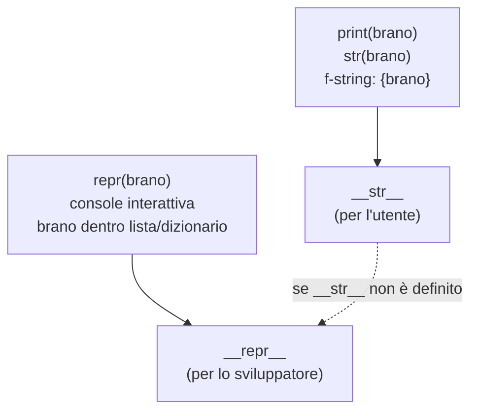

# Mostrare un oggetto

<Epigraph author="William Shakespeare, Romeo e Giulietta">

What's in a name? That which we call a rose<br/>
by any other name would smell as sweet.

</Epigraph>

Alla fine della scorsa lezione ti ho lasciato con un fastidio. Ogni volta che vogliamo mostrare un brano scriviamo a mano la stessa f-string: `print(f"{bohemian.titolo} — {bohemian.artista}")`. È ripetitivo, è facile sbagliarlo, e soprattutto è strano: l'oggetto *sa* tutto di sé — titolo, artista, durata — eppure tocca a noi, da fuori, ricostruirgli la frase ogni volta.

E se fosse il brano stesso a sapersi raccontare? Se potessimo scrivere semplicemente `print(bohemian)` e ottenere una descrizione sensata? Oggi insegniamo all'oggetto a presentarsi da solo. Lo faremo incontrando i primi due **metodi speciali** di Python — quelli con il doppio trattino basso ai lati, i cosiddetti *dunder* — di cui in realtà ne hai già usato uno senza farci caso: `__init__`.

:::prereq

- La lezione precedente, *Metodi di classe e statici* — in particolare attributi e metodi d'istanza, e il fatto che `__init__` viene chiamato da Python per te
- *f-string* per comporre stringhe (`f"{variabile}"`)
- La differenza tra **stampare** un valore (`print`) e **restituirlo** (`return`) da una funzione
- Liste: sapere cosa succede quando ne stampi una con `print`

:::

:::learn

- Cosa sono i **metodi speciali** (*dunder*) e perché Python li chiama al posto tuo
- Come dare a un oggetto una descrizione leggibile con <InlineCode>\_\_str\_\_</InlineCode>, quella che vede l'utente
- Come dare a un oggetto una descrizione **non ambigua** con <InlineCode>\_\_repr\_\_</InlineCode>, quella che serve a chi programma
- Perché `print(brano)` e `print([brano])` non chiamano lo stesso metodo (la sorpresa della lista)
- La regola pratica: definisci **sempre** `__repr__`, aggiungi `__str__` solo quando la versione per l'utente è diversa
- Come far sì che `__repr__` somigli a una chiamata del costruttore — e perché è una buona abitudine

:::

## Cosa stampa un oggetto «nudo»

Partiamo da un `Brano` essenziale, senza alcun metodo speciale oltre a `__init__`. Proviamo a stamparlo direttamente. Prima di premere **Run**, **predici l'output**: cosa comparirà?

```py live
class Brano:
    def __init__(self, titolo, artista, durata):
        self.titolo = titolo
        self.artista = artista
        self.durata = durata


bohemian = Brano("Bohemian Rhapsody", "Queen", 354)
print(bohemian)
```

Ti aspettavi il titolo? E invece esce qualcosa come `<__main__.Brano object at 0x...>`: il nome della classe e un codice esadecimale che è, in pratica, l'indirizzo dell'oggetto in memoria. Tecnicamente è una risposta — ti dice *che tipo* è e *che è unico* — ma a un essere umano non serve a niente. Python non può indovinare quale dei tre dati vuoi vedere, né come comporli: per stamparlo in modo decente, glielo dobbiamo insegnare noi.

## `__str__`: la faccia per l'utente

Quando scrivi <InlineCode kind="function">print(qualcosa)</InlineCode>, dietro le quinte Python chiama il metodo speciale <InlineCode>\_\_str\_\_</InlineCode> di quell'oggetto e stampa ciò che restituisce. Se non l'hai definito, ripiega su quella rappresentazione tecnica di prima. Definiamolo, allora: deve **restituire** (non stampare!) una stringa leggibile.

```py live
class Brano:
    def __init__(self, titolo, artista, durata):
        self.titolo = titolo
        self.artista = artista
        self.durata = durata

    def __str__(self):
        return f"{self.titolo} — {self.artista}"


bohemian = Brano("Bohemian Rhapsody", "Queen", 354)
print(bohemian)
print(f"In riproduzione: {bohemian}")
```

Niente più indirizzi di memoria. E nota la seconda riga: anche dentro una f-string, `{bohemian}` passa da `__str__`. Lo stesso vale per `str(bohemian)`. Da ora il brano sa dire chi è, e noi non dobbiamo più ricostruirgli la frase ogni volta: la formattazione vive **dentro** l'oggetto, in un posto solo. È esattamente la coesione di cui parliamo dalla prima lezione.

:::definition[Metodo speciale (*dunder*)]

Un <Tooltip def="Da 'double underscore', doppio trattino basso. Indica i nomi circondati da due underscore, come __init__ o __str__.">**metodo speciale**</Tooltip> è un metodo dal nome circondato da doppio trattino basso (`__nome__`) che Python chiama **automaticamente** in situazioni precise: `__init__` alla nascita dell'oggetto, `__str__` quando lo stampi. Non lo invochi mai per nome a mano (`bohemian.__str__()` si può, ma non si fa): scrivi `print(bohemian)` e Python si occupa del resto. Sono i ganci con cui i tuoi oggetti si integrano nel linguaggio.

:::

## La sorpresa della lista

Mettiamo i nostri brani in una playlist — una semplice lista — e stampiamola. Abbiamo definito `__str__`, quindi vedremo i titoli, giusto? **Predici l'output** prima di eseguire.

```py live
class Brano:
    def __init__(self, titolo, artista):
        self.titolo = titolo
        self.artista = artista

    def __str__(self):
        return f"{self.titolo} — {self.artista}"


playlist = [
    Brano("Bohemian Rhapsody", "Queen"),
    Brano("Blinding Lights", "The Weeknd"),
]
print(playlist)
```

Ricompaiono gli indirizzi di memoria — `[<__main__.Brano object at 0x...>, ...]` — nonostante `__str__` sia definito. Cos'è successo? Quando stampi una **lista**, Python non chiama `__str__` sui suoi elementi: chiama l'**altro** metodo speciale, <InlineCode>\_\_repr\_\_</InlineCode>. E quello, noi, non l'abbiamo ancora scritto.

Non è un capriccio. C'è un motivo, e ci porta dritti al secondo protagonista della lezione.

## `__repr__`: la faccia per lo sviluppatore

I due metodi rispondono a due domande diverse:

- <InlineCode>\_\_str\_\_</InlineCode> risponde a «come mostro questo oggetto a un **utente**?» → leggibile, discorsivo, anche incompleto.
- <InlineCode>\_\_repr\_\_</InlineCode> risponde a «come descrivo questo oggetto a chi **programma**?» → non ambiguo, preciso, idealmente completo.

Quando in console ispezioni una lista, un dizionario o un oggetto «da solo», sei nei panni dello sviluppatore che vuole capire *esattamente* cosa ha in mano: per questo Python sceglie `__repr__`. La convenzione è che `__repr__` somigli alla **chiamata del costruttore** che ricrea l'oggetto. Aggiungiamolo:

```py live
class Brano:
    def __init__(self, titolo, artista, durata):
        self.titolo = titolo
        self.artista = artista
        self.durata = durata

    def __repr__(self):
        return f"Brano({self.titolo!r}, {self.artista!r}, {self.durata})"

    def __str__(self):
        return f"{self.titolo} — {self.artista}"


bohemian = Brano("Bohemian Rhapsody", "Queen", 354)

print(bohemian)              # __str__ : per l'utente
print(repr(bohemian))        # __repr__: per lo sviluppatore
print([bohemian])            # la lista usa __repr__ su ogni elemento
```

Ora la lista mostra qualcosa di utile: `[Brano('Bohemian Rhapsody', 'Queen', 354)]`. Leggendolo capisci al volo il tipo e tutti i dati, e — colpo di scena — potresti copiarlo, incollarlo nel codice ed eseguirlo per ottenere un brano identico. Questo è il senso di «non ambiguo».

:::code[Il `!r` dentro la f-string]

Hai notato `{self.titolo!r}`? Quel `!r` dice all'f-string: «non inserire il valore con `__str__`, usa il suo `__repr__`». Su una stringa, `__repr__` aggiunge gli apici: ecco perché nell'output compare `'Bohemian Rhapsody'` con le virgolette e non `Bohemian Rhapsody` nudo. È proprio ciò che vuoi in un `__repr__`: la durata (`354`) è un numero e va senza apici, i testi vanno con gli apici, così la stringa somiglia davvero al codice che scriveresti. Provalo: togli i due `!r` e guarda come la rappresentazione diventa subito più ambigua.

:::



Il diagramma mostra chi chiama cosa — e quella freccia tratteggiata è la regola più importante della lezione.

## Quando ne basta uno

I due metodi non sono obbligatori in coppia. C'è un'asimmetria voluta: se definisci **solo** `__repr__`, Python lo usa **anche** come ripiego quando servirebbe `__str__`. Il contrario non vale: definire solo `__str__` lascia `__repr__` con la sua versione tecnica inutile.

```py live
class Brano:
    def __init__(self, titolo, artista):
        self.titolo = titolo
        self.artista = artista

    def __repr__(self):
        return f"Brano({self.titolo!r}, {self.artista!r})"


bury = Brano("Bury a Friend", "Billie Eilish")

print(bury)          # nessun __str__: Python ripiega su __repr__
print(str(bury))     # stesso ripiego
print([bury])        # e __repr__ è già quello giusto per la lista
```

`print(bury)` non trova un `__str__` e usa `__repr__`: ottieni comunque qualcosa di sensato. Da qui la regola pratica.

:::cleancode[Definisci sempre `__repr__`, `__str__` solo se serve]

Per una classe che vale la pena vedere stampata, parti **sempre** da `__repr__`: è la rete di sicurezza che salva ogni `print`, ogni lista, ogni sessione di *debugging*. Scrivi `__str__` in aggiunta **solo quando** la versione per l'utente è davvero diversa da quella per lo sviluppatore (per esempio: `__str__` mostra `Bohemian Rhapsody — Queen`, mentre `__repr__` mostra `Brano('Bohemian Rhapsody', 'Queen', 354)`). Se le due versioni coinciderebbero, un solo `__repr__` ben fatto basta e avanza. E punta a renderlo **non ambiguo**, idealmente uguale alla chiamata del costruttore: il tuo te-del-futuro alle 23, a caccia di un bug, ti ringrazierà.

:::

:::warning[`return`, non `print` — e dev'essere una stringa]

Due errori classici, entrambi silenziosi finché non ti esplodono in mano:

```python
def __str__(self):
    print(f"{self.titolo}")        # ❌ stampa e basta: restituisce None

def __str__(self):
    return self.durata             # ❌ restituisce un int, non una stringa
```

`__str__` e `__repr__` devono **restituire** (`return`) una **stringa**. Se al loro posto fai `print`, il metodo restituisce `None` e ottieni effetti assurdi; se restituisci un numero, Python solleva un `TypeError` al momento della stampa. La forma corretta è sempre `return f"..."`.

:::

## In pratica, sul nostro player

Mettiamo insieme i pezzi su una mini-playlist, con entrambi i metodi e una distinzione netta tra i due usi. Cambia i dati, aggiungi un brano, e osserva come l'una e l'altra faccia restano coerenti senza che tu debba comporre stringhe a mano da nessuna parte.

```py live
class Brano:
    def __init__(self, titolo, artista, durata):
        self.titolo = titolo
        self.artista = artista
        self.durata = durata

    def __repr__(self):
        return f"Brano({self.titolo!r}, {self.artista!r}, {self.durata})"

    def __str__(self):
        return f"{self.titolo} — {self.artista}"


playlist = [
    Brano("Bohemian Rhapsody", "Queen", 354),
    Brano("Blinding Lights", "The Weeknd", 200),
    Brano("Bury a Friend", "Billie Eilish", 193),
]

# Vista per l'utente: una riga leggibile per brano
print("La tua coda:")
for brano in playlist:
    print(f"  ♪ {brano}")          # passa da __str__

# Vista per lo sviluppatore: la lista cruda, non ambigua
print()
print("Stato interno:", playlist)   # ogni elemento passa da __repr__
```

Stessa playlist, due letture: una per chi ascolta, una per chi mette le mani nel codice. È la frase di Shakespeare ribaltata in chiave informatica — il nome con cui mostri la rosa cambia a seconda di chi la guarda, ma la rosa (l'oggetto, con i suoi dati) resta la stessa.

:::history[Il «modello dati» di Python]

`__str__` e `__repr__` sono solo i primi due di una famiglia numerosa. Python definisce decine di metodi speciali che ti permettono di agganciare i tuoi oggetti alle sintassi del linguaggio: `__len__` per far funzionare `len(oggetto)`, `__eq__` per il confronto con `==`, `__add__` per l'operatore `+`, `__iter__` per i cicli `for`. Questo insieme di ganci si chiama **modello dati** (*data model*) e ne incontreremo altri pezzi più avanti, quando insegneremo ai nostri oggetti a essere confrontati, sommati e attraversati. Per ora ti basti sapere che ogni volta che scrivi `__qualcosa__`, stai parlando direttamente all'interprete.

:::

:::nutshell

- I **metodi speciali** (*dunder*, `__nome__`) sono chiamati da Python in automatico in situazioni precise; `__init__` ne è un esempio che già usavi.
- <InlineCode>\_\_str\_\_</InlineCode> dà la versione **leggibile** per l'utente: la usano `print()`, `str()` e le f-string. Deve `return` di una **stringa**.
- <InlineCode>\_\_repr\_\_</InlineCode> dà la versione **non ambigua** per lo sviluppatore: la usano `repr()`, la console e gli elementi dentro **liste e dizionari**. Per convenzione somiglia alla chiamata del costruttore.
- Se manca `__str__`, Python ripiega su `__repr__` (non viceversa): per questo conviene **definire sempre `__repr__`** e aggiungere `__str__` solo quando la vista per l'utente è diversa.
- Nelle f-string, `{valore!r}` forza l'uso di `__repr__` (sulle stringhe aggiunge gli apici): comodo proprio dentro `__repr__`.

:::

<QuizDeck>

<Quiz>
  <QuizQuestion>
    Hai una classe `Brano` con `__str__` definito ma **senza** `__repr__`. Cosa stampa `print([brano])` (il brano dentro una lista)?
  </QuizQuestion>

  <QuizOption>
    La stringa di `__str__`, come per `print(brano)`.
    <QuizFeedback>
      No: `print(brano)` usa `__str__`, ma una **lista** chiede ai suoi elementi il `__repr__`. Sono due metodi diversi, chiamati in situazioni diverse.
    </QuizFeedback>
  </QuizOption>

  <QuizOption correct>
    La rappresentazione tecnica di default, tipo `[<__main__.Brano object at 0x...>]`.
    <QuizFeedback>
      Esatto. La lista usa `__repr__` su ogni elemento, e qui `__repr__` non è stato definito: Python ripiega sulla versione di default con l'indirizzo di memoria. La regola pratica nasce proprio da qui: definisci sempre `__repr__`.
    </QuizFeedback>
  </QuizOption>

  <QuizOption>
    Solleva un errore, perché manca `__repr__`.
    <QuizFeedback>
      No: `__repr__` non è obbligatorio. In sua assenza Python usa la rappresentazione di default — brutta, ma non è un errore.
    </QuizFeedback>
  </QuizOption>

  <QuizOption>
    Una lista vuota, perché `__str__` non si applica agli elementi di una lista.
    <QuizFeedback>
      No: la lista contiene eccome il brano. Il punto è *quale* metodo viene chiamato per rappresentarlo — `__repr__`, non `__str__`.
    </QuizFeedback>
  </QuizOption>
</Quiz>

<Quiz>
  <QuizQuestion>
    Per una classe devi scriverne **uno solo** tra `__str__` e `__repr__`. Quale conviene definire e perché?
  </QuizQuestion>

  <QuizOption>
    `__str__`, perché è quello che usa `print` ed è l'unico che conta davvero.
    <QuizFeedback>
      No: se definisci solo `__str__`, le liste, i dizionari e la console continueranno a mostrare la rappresentazione tecnica inutile, perché quelle usano `__repr__`.
    </QuizFeedback>
  </QuizOption>

  <QuizOption correct>
    `__repr__`, perché in assenza di `__str__` Python ci ripiega — così copri sia il `print` sia le liste e il debugging.
    <QuizFeedback>
      Esatto. Il ripiego va in una sola direzione: manca `__str__` → si usa `__repr__`. Definire `__repr__` ti copre ovunque; `__str__` lo aggiungi solo se la vista per l'utente è diversa.
    </QuizFeedback>
  </QuizOption>

  <QuizOption>
    È indifferente: i due metodi fanno esattamente la stessa cosa.
    <QuizFeedback>
      No: rispondono a domande diverse (utente vs sviluppatore) e vengono chiamati in contesti diversi. E soprattutto il ripiego non è simmetrico.
    </QuizFeedback>
  </QuizOption>

  <QuizOption>
    `__str__`, perché `__repr__` può essere definito solo dopo `__str__`.
    <QuizFeedback>
      No: non c'è alcun ordine obbligato tra i due. Puoi definire `__repr__` da solo, ed è proprio la scelta consigliata.
    </QuizFeedback>
  </QuizOption>
</Quiz>

<Quiz>
  <QuizQuestion>
    Quale di queste è una buona implementazione di `__repr__` per `Brano(titolo, artista, durata)`?
  </QuizQuestion>

  <QuizOption>
    `def __repr__(self): print(f"{self.titolo}")`
    <QuizFeedback>
      No: usa `print` invece di `return`, quindi restituisce `None`. Un metodo di rappresentazione deve **restituire** una stringa, non stamparla.
    </QuizFeedback>
  </QuizOption>

  <QuizOption>
    `def __repr__(self): return self.durata`
    <QuizFeedback>
      No: `self.durata` è un numero. `__repr__` deve restituire una **stringa**, altrimenti ottieni un `TypeError` quando l'oggetto viene mostrato.
    </QuizFeedback>
  </QuizOption>

  <QuizOption correct>
    `def __repr__(self): return f"Brano({self.titolo!r}, {self.artista!r}, {self.durata})"`
    <QuizFeedback>
      Esatto. Restituisce una stringa che somiglia alla chiamata del costruttore: non ambigua, con `!r` che mette gli apici ai testi e lascia il numero nudo. È la convenzione giusta per `__repr__`.
    </QuizFeedback>
  </QuizOption>

  <QuizOption>
    `def __repr__(self): return "un brano"`
    <QuizFeedback>
      Restituisce una stringa, quindi non dà errori — ma è ambigua: due brani diversi sarebbero indistinguibili. `__repr__` dovrebbe dirti *quale* brano hai in mano, dati inclusi.
    </QuizFeedback>
  </QuizOption>
</Quiz>

</QuizDeck>

:::tip[Per andare oltre]

I nostri brani ora si raccontano bene, ma c'è ancora una falla: chiunque, da fuori, può scrivere `bohemian.durata = -50` e darci un brano dalla durata negativa. L'oggetto non si difende. La prossima lezione apre il **Capitolo II** e affronta proprio questo: l'**incapsulamento**, cioè come un oggetto protegge il proprio stato e decide cosa lasciar toccare e cosa no.

Nel frattempo, un esercizio senza fretta: riprendi la classe `Utente` immaginata la scorsa lezione. Scrivi il suo `__repr__` (che assomigli al costruttore: `Utente('mario@...', ...)`) e poi chiediti — la versione per l'utente, lo `__str__`, sarebbe **diversa**? Un profilo social mostra `@mario`, mica l'email completa. Se la risposta è sì, hai trovato il caso in cui valgono entrambi i metodi.

:::
