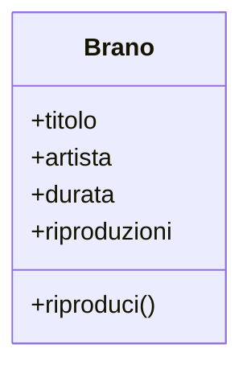

import Tabs from '@theme/Tabs';
import TabItem from '@theme/TabItem';

# Perché gli oggetti?

<Epigraph author="Grace Hopper">

La frase più pericolosa in assoluto è: **«L'abbiamo sempre fatto così.»**

</Epigraph>

Nel primo volume hai imparato a **dare istruzioni**: variabili, condizioni, cicli, funzioni. Sai dire alla macchina *cosa fare, passo dopo passo*. È un superpotere, e per moltissimi problemi è esattamente l'approccio giusto: a uno script di trenta righe che converte un file non serve nessuna cerimonia in più.

In questo volume cambiamo mestiere. Smettiamo di chiederci soltanto «quali passi» e iniziamo a chiederci «quali **cose** esistono nel mio problema, cosa sanno fare, come collaborano». Per scoprire perché ne vale la pena, non partiremo dalla teoria: partiremo costruendo qualcosa e guardandolo rompersi.

Quel qualcosa è **Risonanza**, un piccolo lettore musicale da terminale che ci accompagnerà per buona parte del volume. Oggi ha tre canzoni. Tra poco ne avrà trecento, e proprio lì il nostro codice procedurale comincerà a scricchiolare.

:::prereq

- Sintassi Python di base: variabili, tipi primitivi, condizionali, cicli
- Funzioni: definizione, parametri, valori di ritorno
- Liste e dizionari: creazione, accesso per indice e per chiave, `append`
- *f-string* per comporre messaggi (`f"{nome} ha {eta} anni"`)

:::

:::learn

- Perché il codice puramente procedurale fatica a reggere quando il programma cresce
- Cos'è il problema delle **liste parallele** e perché genera bug silenziosi
- Perché anche i dizionari, da soli, non risolvono tutto
- L'idea-madre della programmazione a oggetti: **tenere insieme dati e comportamento**
- La differenza intuitiva tra **classe** (lo stampo) e **oggetto** (la cosa concreta)
- Quando la OOP aiuta davvero e quando sarebbe solo cerimonia inutile

:::

## Un caso concreto: la libreria di Risonanza

Vogliamo rappresentare i brani della nostra libreria. Con gli strumenti del Volume 1, la mossa naturale è una variabile per ogni caratteristica. Tre brani, quattro informazioni a testa (titolo, artista, durata in secondi, numero di riproduzioni): le teniamo in **liste parallele**, cioè liste diverse dove la posizione `i` descrive sempre lo stesso brano.

```py live
titoli       = ["Blinding Lights", "Bohemian Rhapsody", "Bury a Friend"]
artisti      = ["The Weeknd",      "Queen",             "Billie Eilish"]
durate       = [200,               354,                 193]
riproduzioni = [0,                 0,                   0]

def riproduci(indice):
    riproduzioni[indice] += 1
    print(f"▶  {titoli[indice]} — {artisti[indice]}")

riproduci(0)
riproduci(0)
riproduci(2)

print(f"\n'{titoli[0]}' è stato ascoltato {riproduzioni[0]} volte")
```

Funziona. Premi **Run** e vedrai i brani riprodotti e il contatore aggiornato. Con tre canzoni va tutto liscio: l'indice `0` è sempre *Blinding Lights*, in tutte e quattro le liste. Il dato e il suo significato stanno in piedi grazie a un patto implicito — *"la posizione `i` è sempre lo stesso brano"* — che per ora rispettiamo con disciplina.

Il problema dei patti impliciti è che reggono finché qualcuno si ricorda di rispettarli.

## Quando la collezione cresce

Arriva la prima richiesta: aggiungere **l'anno di uscita** a ogni brano. Con le liste parallele significa creare una quinta lista, `anni = [...]`, e tenerla allineata alle altre quattro. Poi arriva un brano nuovo: per aggiungerlo devi ricordarti di fare `append` su **tutte e cinque** le liste, nello stesso ordine. Ne dimentichi una?

```python
titoli.append("As It Was")
artisti.append("Harry Styles")
durate.append(167)
# ...e qui ti squilla il telefono. Riproduzioni e anni non li aggiorni.
```

Da questo momento la posizione `i` non descrive più lo stesso brano in tutte le liste. Il patto è rotto, e Python non se ne accorge: continua a indicizzare felice, restituendoti dati di un brano mescolati con quelli di un altro.

Vediamolo in azione con un caso ancora più insidioso. Vogliamo ordinare i brani **dal più lungo al più corto**. Prima di premere Run, prova a **predire l'output**: cosa stamperà questo codice?

```py live
titoli = ["Blinding Lights", "Bohemian Rhapsody", "Bury a Friend"]
durate = [200,               354,                 193]

# Ordino le durate dalla più lunga alla più corta
durate.sort(reverse=True)

for i in range(len(titoli)):
    print(f"{titoli[i]} — {durate[i]}s")
```

Hai predetto durate ordinate accanto ai titoli giusti? Quello che ottieni è *Blinding Lights* che dura 354 secondi (sono quasi sei minuti: chiunque l'abbia ascoltata sa che non è vero) e *Bohemian Rhapsody* sbrigata in 200. Abbiamo riordinato `durate` ma **non** `titoli`: gli indici non si corrispondono più, e ogni titolo si ritrova accanto alla durata di un altro.

:::warning[Il bug peggiore è quello che non urla]

Nota una cosa: Python non ha sollevato **nessun** errore. Nessun `IndexError`, nessuna eccezione, nessun avviso rosso. Ti ha restituito risultati sbagliati con la faccia serissima.

I bug che fanno crashare il programma sono fastidiosi ma onesti: ti dicono dove guardare. I bug *silenziosi* — dati corrotti che sembrano plausibili — sono molto peggio, perché finiscono in produzione e li scopri solo quando un utente si lamenta che la sua canzone preferita dura sei minuti. Le liste parallele sono una fabbrica di bug di questo tipo.

:::

Il problema di fondo è che le informazioni di un singolo brano sono **sparse** su strutture diverse, tenute insieme solo da un indice numerico e dalla nostra buona memoria. Più la libreria cresce, più liste e più funzioni dobbiamo tenere sincronizzate a mano. È il labirinto da cui vogliamo uscire.

## I dizionari aiutano… ma non bastano

Hai già uno strumento del Volume 1 che migliora le cose: il **dizionario**. Invece di spargere i campi di un brano su quattro liste, li raccogliamo in un'unica struttura con chiavi parlanti.

```py live
brano = {
    "titolo":       "Bohemian Rhapsody",
    "artista":      "Queen",
    "durata":       354,
    "riproduzioni": 0,
}

brano["riproduzioni"] += 1
print(f"{brano['titolo']} — ascoltato {brano['riproduzioni']} volta/e")
```

Questo è un passo avanti vero: ora i dati di un brano **viaggiano insieme** in un solo oggetto. Una lista di dizionari la puoi ordinare senza disallineare niente, perché ogni dizionario si porta dietro tutti i suoi campi. Il bug della sezione precedente, qui, sparisce.

E allora basta così, mettiamo tutto in dizionari e andiamo al mare? Non proprio. Restano due crepe:

- **Il comportamento abita altrove.** I *dati* del brano stanno nel dizionario, ma le *azioni* che lo riguardano — riprodurlo, calcolare la durata in minuti, sapere se è un tormentone — vivono in funzioni separate, sparse nel file. Dati di qua, comportamento di là: il legame torna a essere implicito.
- **Niente difende la coerenza.** Nessuno ti impedisce di scrivere `brano["durata"] = -5` (un brano di durata negativa) o di fare un refuso come `brano["titlo"]`, che Python accetta in silenzio creando una chiave nuova e sbagliata. Il dizionario è un contenitore neutro: non sa cosa significhi *essere un brano valido*, quindi non può proteggerti.

Ci serve qualcosa che faccia due cose insieme: tenere i dati di un brano e i comportamenti che li riguardano **nello stesso posto**, e dare a quel "posto" un'identità — *questo è un brano*, con le sue regole.

## L'idea: tenere insieme dati e comportamento

Eccola, l'idea-madre di tutto il volume. Tienila a mente, perché incapsulamento, ereditarietà, polimorfismo e pattern non sono altro che conseguenze e strumenti di questa frase:

:::definition[Oggetto, classe, istanza]

Un **oggetto** raccoglie in un'unica unità i **dati** che descrivono un'entità (il suo <Tooltip def="L'insieme dei valori che un oggetto possiede in un dato momento: per un brano, il titolo, l'artista, la durata e il numero di riproduzioni.">stato</Tooltip>) e i **comportamenti** che operano su quei dati (le sue azioni).

Una **classe** è lo **stampo** che descrive com'è fatto un certo tipo di oggetto. Un **oggetto** (o **istanza**) è la creazione concreta prodotta da quello stampo.

:::

L'analogia classica è quella dei biscotti. La **classe** è lo stampo per i biscotti: definisce la forma "brano" — avrà un titolo, un artista, una durata, e saprà essere riprodotto. Gli **oggetti** sono i biscotti che sforni: *Bohemian Rhapsody*, *Blinding Lights*, *Bury a Friend*. Ognuno è un brano, ma è un'entità separata con i suoi valori. Lo stampo esiste una volta sola nel codice; gli oggetti possono essere centinaia.

Guarda come diventa la nostra rappresentazione di un brano. Non spaventarti per la parola <InlineCode kind="keyword">class</InlineCode>, per <InlineCode>self</InlineCode> o per quel `__init__` dall'aria criptica: la **meccanica** è il cuore della prossima lezione. Qui voglio che tu noti **una cosa sola** — i dati del brano e ciò che sai farci vivono nello stesso blocco.

```py live
class Brano:
    def __init__(self, titolo, artista, durata):
        self.titolo = titolo
        self.artista = artista
        self.durata = durata
        self.riproduzioni = 0

    def riproduci(self):
        self.riproduzioni += 1
        return f"▶  {self.titolo} — {self.artista}"


bohemian = Brano("Bohemian Rhapsody", "Queen", 354)

print(bohemian.riproduci())
print(bohemian.riproduci())
print(f"'{bohemian.titolo}' ascoltato {bohemian.riproduzioni} volte")
```

Nessuna lista parallela. Nessun indice da tenere allineato. Il titolo, la durata e il contatore di riproduzioni sono attaccati a `bohemian`, e l'azione `riproduci()` agisce esattamente su *quel* brano. Se domani crei un secondo brano, avrà il suo stato indipendente — sforniamo lo stampo una volta, sforniamo quanti biscotti vogliamo.

Possiamo disegnare lo stampo `Brano` con uno schema — è il primo assaggio di **UML**, la notazione con cui i programmatori si scambiano disegni di classi (la useremo spesso in questo volume):



Lo scomparto in alto elenca i **dati** (lo stato: titolo, artista, durata, riproduzioni); quello in basso elenca i **comportamenti** (le azioni: `riproduci()`). Il punto non è la grafica: è che entrambi stanno **nella stessa scatola**. Quella scatola è la classe — l'idea-madre resa visibile.

:::history[Da dove arriva tutto questo]

L'idea nasce alla fine degli anni '60 con **Simula**, un linguaggio norvegese pensato per le simulazioni: per simulare un mondo, conveniva rappresentare nel codice le "cose" di quel mondo. Negli anni '70 **Alan Kay**, allo Xerox PARC, la spinge all'estremo con **Smalltalk**: per lui un programma è un insieme di piccole entità — gli oggetti — che si scambiano messaggi, come cellule biologiche o computer in rete. È l'idea che oggi sta dentro Python, Java, C++, Swift e metà di internet.

Curiosità che fa umiltà: Kay stesso ha ripetuto più volte che «la OOP, come la intendevo io, non è quella che la maggior parte dei linguaggi chiama OOP oggi». Morale: prendi sempre con un pizzico di sale anche quello che leggi qui.

:::

E il bug del disallineamento? Semplicemente non può più capitare, perché ogni brano si porta dietro tutti i suoi campi, incollati dentro lo stesso oggetto:

```py live
class Brano:
    def __init__(self, titolo, durata):
        self.titolo = titolo
        self.durata = durata


brani = [
    Brano("Blinding Lights", 200),
    Brano("Bohemian Rhapsody", 354),
    Brano("Bury a Friend", 193),
]

for brano in brani:
    print(f"{brano.titolo} — {brano.durata}s")
```

Riordina pure questa lista come vuoi: titolo e durata viaggiano insieme dentro l'oggetto, non c'è un secondo elenco da tenere sincronizzato. Il patto implicito è diventato una struttura esplicita.

:::warning[La OOP non è una religione]

Prima che l'entusiasmo prenda il sopravvento: non uscire da questa lezione convinto che «d'ora in poi tutto va in una classe». Non è così. Aggiungere classi a uno script di trenta righe che fa una cosa sola è cerimonia inutile, e a volte un dizionario o una funzione sono semplicemente la risposta giusta.

La OOP è uno **strumento** per gestire la complessità: brilla quando hai molte entità con stato e comportamento propri, e diventa peso morto quando non ne hai. Nei prossimi mesi imparerai a usarla *e* a sapere quando lasciarla nel cassetto.

:::

### Procedurale contro oggetti, fianco a fianco

Lo stesso compito — riprodurre un brano e contarne gli ascolti — nei due mondi:

<Tabs>
  <TabItem value="oop" label="A oggetti" default>
    ```python
    class Brano:
        def __init__(self, titolo, artista):
            self.titolo = titolo
            self.artista = artista
            self.riproduzioni = 0

        def riproduci(self):
            self.riproduzioni += 1

    # Dati e comportamento nello stesso posto
    brano = Brano("Bury a Friend", "Billie Eilish")
    brano.riproduci()
    ```
  </TabItem>
  <TabItem value="proc" label="Procedurale">
    ```python
    titoli       = ["Bury a Friend"]
    artisti      = ["Billie Eilish"]
    riproduzioni = [0]

    # Il comportamento vive lontano dai dati,
    # tenuto insieme solo dall'indice
    def riproduci(indice):
        riproduzioni[indice] += 1

    riproduci(0)
    ```
  </TabItem>
</Tabs>

Non è una questione di righe in meno (a volte la versione a oggetti è perfino più lunga). È una questione di **dove vivono le cose**: nel mondo a oggetti, se devi capire come funziona un brano, sai esattamente dove guardare. Tutto ciò che lo riguarda è dentro la sua classe.

:::cleancode[Tieni vicino ciò che cambia insieme]

Il principio che hai appena visto all'opera ha un nome: **coesione**. Le informazioni e i comportamenti che riguardano la stessa entità dovrebbero stare vicini, idealmente nella stessa unità di codice.

Le liste parallele violano la coesione nel modo più plateale: per cambiare *una* cosa del brano (aggiungere un campo, ordinarli) devi toccare *tre o quattro* posti diversi e ricordarti di tenerli allineati. Una classe `Brano` raccoglie quel sapere in un punto solo — diventa l'**unica fonte di verità** su cosa sia un brano. Quando aggiungerai un campo, lo aggiungerai lì, e basta.

:::

## Cosa ci portiamo dietro

:::nutshell

- Il codice **procedurale** è perfetto per problemi piccoli, ma fatica quando le entità da gestire si moltiplicano.
- Le **liste parallele** disperdono i dati di un'entità su strutture diverse, tenute insieme solo da un indice: fragili e fonte di **bug silenziosi** (il disallineamento non solleva errori).
- I **dizionari** raggruppano i dati di un'entità, ma lasciano il comportamento altrove e non difendono la coerenza.
- L'**idea-madre della OOP**: tenere insieme, in un'unica unità, i **dati** (lo stato) e i **comportamenti** (le azioni) di un'entità.
- Una **classe** è lo stampo; un **oggetto** (o **istanza**) è la creazione concreta. Uno stampo, tanti biscotti.
- La OOP è uno **strumento**, non un obbligo: si usa quando la complessità lo ripaga.

:::

<QuizDeck>

<Quiz>
  <QuizQuestion>
    Nel codice procedurale con liste parallele, ordini **una sola** delle liste (per esempio `durate`). Qual è il rischio principale?
  </QuizQuestion>

  <QuizOption>
    Il programma rallenta sensibilmente perché l'ordinamento è un'operazione costosa.
    <QuizFeedback>
      Le prestazioni non c'entrano: ordinare poche centinaia di elementi è istantaneo. Il problema è sui dati, non sulla velocità.
    </QuizFeedback>
  </QuizOption>

  <QuizOption>
    Python solleva un `IndexError` perché le liste hanno lunghezze diverse.
    <QuizFeedback>
      Magari! Un errore esplicito sarebbe un favore. Le liste mantengono la stessa lunghezza: cambia solo l'ordine di una di esse, e Python continua a indicizzare senza protestare.
    </QuizFeedback>
  </QuizOption>

  <QuizOption correct>
    Gli indici non si corrispondono più: ogni titolo si ritrova accanto ai dati di un altro brano, **senza alcun errore**.
    <QuizFeedback>
      Esatto. È il bug peggiore proprio perché è silenzioso: nessuna eccezione, solo dati plausibili ma sbagliati. È la ragione numero uno per cui le liste parallele non scalano.
    </QuizFeedback>
  </QuizOption>

  <QuizOption>
    Le durate vengono cancellate dalla lista.
    <QuizFeedback>
      No: `sort` riordina gli elementi, non li elimina. Restano tutti, ma accoppiati ai titoli sbagliati.
    </QuizFeedback>
  </QuizOption>
</Quiz>

<Quiz>
  <QuizQuestion>
    Qual è l'**idea centrale** della programmazione a oggetti?
  </QuizQuestion>

  <QuizOption>
    Sostituire sempre le funzioni con le classi: ogni funzione libera è codice da rifattorizzare.
    <QuizFeedback>
      No, ed è un fraintendimento comune. La OOP è uno strumento, non un obbligo: per molti problemi piccoli una funzione resta la scelta migliore.
    </QuizFeedback>
  </QuizOption>

  <QuizOption correct>
    Tenere insieme, in un'unica unità, i **dati** di un'entità e i **comportamenti** che operano su quei dati.
    <QuizFeedback>
      Esatto: è l'idea-madre da cui discende tutto il resto del volume. Un brano e ciò che sai farci vivono nello stesso oggetto.
    </QuizFeedback>
  </QuizOption>

  <QuizOption>
    Evitare i dizionari, perché non permettono di proteggere i dati.
    <QuizFeedback>
      I dizionari non sono il nemico: sono uno strumento utilissimo. Sono un passo avanti rispetto alle liste parallele; semplicemente non bastano da soli a unire dati e comportamento.
    </QuizFeedback>
  </QuizOption>

  <QuizOption>
    Rendere il codice più veloce da eseguire.
    <QuizFeedback>
      La OOP riguarda l'**organizzazione** e la manutenibilità del codice, non la sua velocità. Un programma a oggetti non è intrinsecamente più rapido di uno procedurale.
    </QuizFeedback>
  </QuizOption>
</Quiz>

</QuizDeck>

:::tip[Per andare oltre]

Hai visto *che cosa* fa una classe e *perché* ci serve. La prossima lezione scioglie il **come**: cosa significa davvero `__init__`, perché quel `self` compare ovunque, come si distinguono attributi e metodi. Continueremo proprio da `Brano`, dandogli più comportamenti e affiancandogli la `Playlist`.

Nel frattempo, una domanda per riflettere: pensa a un'app che usi ogni giorno (una chat, un gioco, un social). Quali sarebbero i suoi **oggetti**? Per ciascuno, quali **dati** porterebbe con sé e quali **azioni** saprebbe compiere? Non c'è codice da scrivere: è l'allenamento mentale con cui inizia ogni buon progetto a oggetti.

:::
