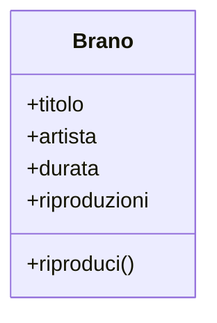

import Tabs from '@theme/Tabs';
import TabItem from '@theme/TabItem';

# Perché gli oggetti?

<Epigraph author="Fred Brooks, The Mythical Man-Month (1975)">

Mostrami i tuoi diagrammi di flusso e nascondimi le tue tabelle, e resterò perplesso. Mostrami le tue tabelle, e di solito i diagrammi non mi serviranno: saranno ovvi.

</Epigraph>

Nel primo volume hai imparato a dare istruzioni: variabili, condizioni, cicli, funzioni. Sai dire alla macchina cosa fare, passo dopo passo, e per moltissimi problemi è esattamente quello che serve.

Questo volume aggiunge una domanda che finora non ti sei posto: come rappresento le _cose_ di cui il programma parla? Un brano musicale, un giocatore, un conto corrente non sono passi da eseguire. Sono entità: hanno delle informazioni addosso e delle operazioni che hanno senso solo su di loro. Il modo in cui le rappresenti decide quanto sarà faticoso tutto il resto del programma.

Lo vediamo su **Risonanza**, un piccolo lettore musicale da terminale che ci accompagnerà per tutto il volume. La sua libreria, per ora, contiene tre brani — e già con tre bastano due righe di codice per farla sbagliare.

:::prereq

- Sintassi Python di base: variabili, tipi primitivi, condizionali, cicli
- Funzioni: definizione, parametri, valori di ritorno
- Liste e dizionari: creazione, accesso per indice e per chiave, `append`
- _f-string_ per comporre messaggi (`f"{nome} ha {eta} anni"`)

:::

:::learn

- Perché la posizione, da sola, è un legame fragile fra dati che descrivono la stessa entità
- La differenza fra un errore che ferma il programma e uno che lo lascia proseguire con dati sbagliati
- Cosa risolvono i dizionari e cosa lasciano aperto
- Cosa sono una **classe**, un **oggetto** e un'**istanza**
- Cosa significa **coesione** e perché non vuol dire "metti tutto dentro la classe"
- Con quali criteri decidere se una classe serve

:::

## Rappresentare un brano

Un brano ha un titolo, un artista, una durata in secondi e un contatore di riproduzioni. Con gli strumenti del Volume 1 la strada più diretta è una lista per ogni informazione. A tenere insieme il tutto è la posizione: l'elemento di indice `i` di ogni lista appartiene allo stesso brano. Si chiamano **liste parallele**.

```py live
titoli       = ["Blinding Lights", "Bohemian Rhapsody", "Bury a Friend"]
artisti      = ["The Weeknd",      "Queen",             "Billie Eilish"]
durate       = [200,               354,                 193]
riproduzioni = [0,                 0,                   0]

def riproduci(indice):
    riproduzioni[indice] += 1
    print(f"▶  {titoli[indice]} — {artisti[indice]}")

riproduci(0)
riproduci(0)
riproduci(2)

print(f"\n'{titoli[0]}' è stato ascoltato {riproduzioni[0]} volte")
```

Con tre brani funziona: l'indice `0` è _Blinding Lights_ in tutte e quattro le liste, e `riproduci(0)` incrementa il contatore giusto stampando il titolo giusto.

La corrispondenza, però, esiste soltanto nella nostra testa. Python non sa che `titoli[0]` e `durate[0]` parlano della stessa canzone: per lui sono due liste indipendenti che al momento hanno la stessa lunghezza. Tenerle allineate è un lavoro nostro, e nessuno ci avvisa quando smettiamo di farlo.

## Due modi di rompere l'allineamento

Aggiungiamo un brano alla libreria. Vanno aggiornate tutte e quattro le liste, nello stesso ordine, e basta una distrazione:

```python
titoli.append("As It Was")
artisti.append("Harry Styles")
durate.append(167)
```

`riproduzioni` è rimasta indietro: ha tre elementi, le altre ne hanno quattro. Questo è il caso fortunato. Alla prima chiamata di `riproduci(3)` Python cerca `riproduzioni[3]`, non lo trova e solleva un `IndexError`. Il programma si ferma e ti dice dove guardare.

Il caso sfortunato è l'altro: liste della stessa lunghezza, ma non dello stesso ordine. Si presenta appena provi a ordinare i brani dal più lungo al più corto. Prima di eseguire il codice, prova a predire cosa stampa.

```py live
titoli = ["Blinding Lights", "Bohemian Rhapsody", "Bury a Friend"]
durate = [200,               354,                 193]

durate.sort(reverse=True)

for i in range(len(titoli)):
    print(f"{titoli[i]} — {durate[i]}s")
```

Le durate escono ordinate, 354 → 200 → 193, ma accanto ai titoli sbagliati: _Blinding Lights_ risulta di 354 secondi e _Bohemian Rhapsody_ di 200. Il metodo `sort` ha riordinato `durate` e nient'altro, mentre `titoli` è rimasta com'era. Un solo brano si salva, _Bury a Friend_, e solo perché era già in ultima posizione in entrambe le liste.

:::warning[Un errore che il programma non segnala]

Qui non compare nessuna eccezione, e non è una svista dell'interprete: le due liste hanno tre elementi ciascuna, gli indici da `0` a `2` sono validi in entrambe, ogni accesso restituisce un valore che esiste. L'unica cosa sbagliata è l'_abbinamento_ fra i due valori, e l'abbinamento non è scritto da nessuna parte nel codice. È una convenzione nostra, e Python non può far rispettare una regola che non gli abbiamo mai detto.

Un programma che si ferma con un errore è scomodo ma leale. Uno che prosegue producendo numeri plausibili ti lascia scoprire il guasto mesi dopo, quando qualcuno segnala che una canzone di tre minuti sull'app ne dura sei.

:::

Il colpevole non è `sort`. Le informazioni di un brano sono sparse su quattro strutture diverse e l'unico legame fra loro è un numero, quindi qualunque operazione che tocchi una lista sola lo spezza. Non è nemmeno colpa della programmazione procedurale: un programma procedurale può rappresentare i brani molto meglio di così, e fra un attimo lo facciamo.

## I dizionari raccolgono i dati

Uno strumento del Volume 1 sistema buona parte della faccenda: il dizionario. Tutte le informazioni di un brano stanno in una struttura sola, con chiavi che dicono cosa sono.

```py live
brano = {
    "titolo":       "Bohemian Rhapsody",
    "artista":      "Queen",
    "durata":       354,
    "riproduzioni": 0,
}

brano["riproduzioni"] += 1
print(f"{brano['titolo']} — ascoltato {brano['riproduzioni']} volta/e")
```

Una lista di dizionari la puoi ordinare, filtrare e rimescolare quanto vuoi: ogni dizionario si porta dietro tutti i suoi campi, quindi il disallineamento della sezione precedente non può proprio nascere. È un passo avanti vero, e per parecchi programmi è già la soluzione definitiva.

Restano due cose che il dizionario non fa.

Le **operazioni stanno altrove**. Riprodurre un brano o convertirne la durata in minuti sono funzioni sparse nel file, e niente nel codice dichiara che riguardano proprio quel tipo di dizionario. Per sapere cosa si può fare con un brano devi leggere il modulo e riconoscere a occhio le funzioni che accettano un brano come argomento.

Non c'è un **posto dove mettere le regole**. `brano["durata"] = -5` viene accettato. Anche `brano["titlo"] = "..."`: Python aggiunge una chiave nuova, il refuso resta lì e te ne accorgi solo quando rileggi `brano["titolo"]` e trovi il valore vecchio. Un dizionario memorizza coppie chiave-valore; il concetto di "brano valido" non esiste al suo interno, quindi non c'è nessun controllo possibile.

## Tenere insieme dati e comportamento

Brooks, in cima alla pagina, aveva ragione a metà: la struttura dei dati rende ovvio il resto del programma, ma solo se il resto le sta vicino. L'idea da cui nasce la programmazione a oggetti aggiunge esattamente questo pezzo — le informazioni che descrivono un'entità e le operazioni che la riguardano si dichiarano nello stesso posto.

:::definition[Oggetto, classe, istanza]

Un **oggetto** riunisce in un'unica unità i **dati** che descrivono un'entità (il suo <Tooltip def="L'insieme dei valori che un oggetto possiede in un dato momento: per un brano, il titolo, l'artista, la durata e il numero di riproduzioni.">stato</Tooltip>) e i **comportamenti** che operano su quei dati.

Una **classe** è la descrizione di un tipo di oggetto: stabilisce quali dati avrà e quali operazioni saprà compiere. Un oggetto costruito a partire da una classe si dice anche **istanza** di quella classe.

:::

Una classe funziona come uno stampo: esiste una volta sola nel codice, e da lì escono quanti oggetti vuoi, ciascuno con i propri valori. Lo stampo però non contiene i biscotti e non ne conserva copie — descrive la forma, e la forma viene applicata nel momento in cui crei l'oggetto.

Non serve capire ora `class`, `self` e `__init__`: sono il cuore della prossima lezione. Nella classe `Brano` qui sotto conta una cosa sola, cioè dove stanno le informazioni del brano e dove sta ciò che sai farci.

```py live
class Brano:
    def __init__(self, titolo, artista, durata):
        self.titolo = titolo
        self.artista = artista
        self.durata = durata
        self.riproduzioni = 0

    def riproduci(self):
        self.riproduzioni += 1
        return f"▶  {self.titolo} — {self.artista}"


bohemian = Brano("Bohemian Rhapsody", "Queen", 354)

print(bohemian.riproduci())
print(bohemian.riproduci())
print(f"'{bohemian.titolo}' ascoltato {bohemian.riproduzioni} volte")
```

`titolo`, `artista`, `durata` e `riproduzioni` appartengono a `bohemian`, e `riproduci()` è dichiarata dentro `Brano`: agisce sul brano su cui la chiami, non su un brano generico. Crea un secondo oggetto e avrà il suo contatore, del tutto indipendente dal primo.

:::cleancode[Coesione]

Il principio ha un nome: **coesione**, cioè quanto le parti di un'unità di codice riguardano la stessa cosa. Le liste parallele ne hanno pochissima — per aggiungere un campo al brano devi modificare quattro punti e ricordarti di tenerli allineati — mentre la classe `Brano` raccoglie in un punto solo la risposta alla domanda "com'è fatto un brano".

Attenzione a non leggerlo come "tutto ciò che riguarda i brani va dentro `Brano`". Salvarli su disco o cercarli per artista sono compiti che di solito stanno meglio altrove: una classe che li assorbe tutti torna a essere un contenitore di cose scollegate, con un nome più elegante. La coesione premia chi tiene vicino ciò che cambia insieme, non chi ammassa.

:::

### Cosa sparisce e cosa no

Il bug dell'ordinamento, con gli oggetti, non è più scrivibile: non esistono due liste da riordinare separatamente, perché titolo e durata sono attributi dello stesso oggetto.

```py live
class Brano:
    def __init__(self, titolo, durata):
        self.titolo = titolo
        self.durata = durata


brani = [
    Brano("Blinding Lights", 200),
    Brano("Bohemian Rhapsody", 354),
    Brano("Bury a Friend", 193),
]

brani.reverse()

for brano in brani:
    print(f"{brano.titolo} — {brano.durata}s")
```

Rimescola la lista come preferisci: qualunque cosa tu faccia all'ordine, sposti oggetti interi, e ogni titolo si porta dietro la sua durata.

Sparisce quel bug, non la possibilità di sbagliare in generale. Puoi ancora costruire un `Brano` passando la durata di un altro, o scrivere `bohemian.durata = -5` senza che nessuno protesti: la classe che hai appena visto non controlla niente. Darle il potere di rifiutare valori assurdi è possibile ed è l'argomento della lezione sull'_incapsulamento_. Per adesso hai ottenuto qualcosa di più modesto e più utile: un posto preciso in cui quelle regole potranno stare.

### La classe disegnata

Una classe si può rappresentare anche graficamente, e in questo volume lo faremo spesso:


```mermaid
classDiagram
    class Brano {
        +titolo
        +artista
        +durata
        +riproduzioni
        +riproduci()
    }
```

Lo scomparto superiore elenca gli attributi, quello inferiore i metodi. È **UML**, la notazione con cui i programmatori si scambiano la struttura di un sistema senza doverne leggere il codice.

## Procedurale e oggetti, un confronto onesto

Il confronto con le liste parallele è troppo facile: nessuno le userebbe per scelta. Un programma procedurale scritto con criterio userebbe un dizionario e una funzione che lo riceve come argomento.

<Tabs>
  <TabItem value="oop" label="A oggetti" default>
    ```python
    class Brano:
        def __init__(self, titolo, artista):
            self.titolo = titolo
            self.artista = artista
            self.riproduzioni = 0

        def riproduci(self):
            self.riproduzioni += 1

    brano = Brano("Bury a Friend", "Billie Eilish")
    brano.riproduci()
    ```

  </TabItem>
  <TabItem value="proc" label="Procedurale">
    ```python
    def crea_brano(titolo, artista):
        return {
            "titolo": titolo,
            "artista": artista,
            "riproduzioni": 0,
        }

    def riproduci(brano):
        brano["riproduzioni"] += 1

    brano = crea_brano("Bury a Friend", "Billie Eilish")
    riproduci(brano)
    ```

  </TabItem>
</Tabs>

Le due versioni fanno la stessa cosa e occupano più o meno lo stesso spazio. Le differenze sono altre due, e nessuna riguarda la velocità di esecuzione.

La prima è dove si cerca. Nella versione a oggetti l'elenco di ciò che un brano sa fare coincide con la classe: apri `Brano` e lo leggi tutto. Nella versione procedurale devi scorrere il modulo e capire quali funzioni si aspettano un brano — informazione che non è scritta da nessuna parte, se non nei nomi dei parametri.

La seconda è dove si controlla. `riproduci(brano)` si fida di ricevere un dizionario fatto nel modo giusto; se vuoi verificarlo, ogni funzione deve controllare per conto proprio. Una classe ti dà un solo punto d'ingresso in cui stabilire cosa conta come brano valido.

## Quando conviene

Le classi costano: righe in più e un livello di indirezione fra te e i dati. Il conto torna quando il programma gestisce parecchie entità con stato e comportamento propri, quando le stesse entità compaiono in punti lontani del codice, quando il programma è destinato a durare e a essere modificato da qualcuno che non sei tu. Uno script di trenta righe che legge un file e stampa una media non ci guadagna niente: ci guadagna solo righe.

Python, del resto, non ti chiede di schierarti. Funzioni, dizionari e classi convivono nello stesso file, e i programmi veri le mescolano quasi sempre.

:::history[Da dove arriva]

L'idea nasce alla fine degli anni Sessanta con **Simula**, un linguaggio norvegese pensato per le simulazioni: per simulare un porto o un traffico conveniva rappresentare nel codice le cose di quel mondo, ciascuna con il proprio stato. Negli anni Settanta **Alan Kay**, allo Xerox PARC, la porta all'estremo con **Smalltalk**, dove un programma è un insieme di piccole entità autonome che si scambiano messaggi.

Kay ha poi passato decenni a ripetere che "la OOP, come la intendevo io, non è quella che la maggior parte dei linguaggi chiama OOP oggi": a lui interessava soprattutto lo scambio di messaggi fra entità indipendenti, molto più delle classi. Quello che trovi in Python, in Java o in C++ è una versione più addomesticata di quell'idea.

:::

## In sintesi

:::nutshell

- La difficoltà di un programma che cresce non sta nel numero di righe, ma nel modo in cui rappresenta le sue entità.
- Le **liste parallele** affidano il legame fra i dati alla posizione. Si rompono in due modi: lunghezze diverse (`IndexError`, esplicito) oppure ordini diversi (nessun errore, dati sbagliati).
- Un **dizionario** tiene insieme i dati di un'entità, ma lascia le operazioni fuori e non offre un posto dove mettere le regole.
- Una **classe** dichiara insieme dati e comportamenti; un **oggetto** (o **istanza**) è un esemplare costruito da quella classe, con i propri valori.
- **Coesione**: tenere vicino ciò che cambia insieme, senza per questo ammassare nella classe tutto ciò che sfiora l'entità.
- Le classi si usano quando ripagano la complessità che aggiungono, non per principio.

:::

<QuizDeck>

<Quiz>
  <QuizQuestion>
    Hai due liste parallele `titoli` e `durate`, entrambe di tre elementi, e ordini soltanto `durate`. Cosa succede?
  </QuizQuestion>

<QuizOption>
  Il programma rallenta sensibilmente, perché l'ordinamento è un'operazione
  costosa.
  <QuizFeedback>
    Le prestazioni non c'entrano: ordinare tre elementi è istantaneo. Il
    problema riguarda quali dati finiscono accanto a quali.
  </QuizFeedback>
</QuizOption>

<QuizOption>
  Python solleva un `IndexError`.
  <QuizFeedback>
    No: `sort` cambia l'ordine degli elementi, non il loro numero. Le due liste
    restano di tre elementi e tutti gli indici da `0` a `2` restano validi.
    L'`IndexError` si ottiene nell'altro caso, quando una lista resta più corta
    delle altre.
  </QuizFeedback>
</QuizOption>

<QuizOption correct>
  Il programma prosegue senza errori, ma ogni titolo può ritrovarsi accanto alla
  durata di un altro brano.
  <QuizFeedback>
    Esatto. Ogni accesso è legittimo, quindi l'interprete non ha nulla da
    segnalare: l'unica cosa sbagliata è l'abbinamento, che nel codice non è
    scritto da nessuna parte.
  </QuizFeedback>
</QuizOption>

  <QuizOption>
    Le durate vengono eliminate dalla lista.
    <QuizFeedback>
      No: `sort` riordina gli elementi sul posto, non ne rimuove nessuno.
    </QuizFeedback>
  </QuizOption>
</Quiz>

<Quiz>
  <QuizQuestion>
    Qual è l'idea da cui nasce la programmazione a oggetti?
  </QuizQuestion>

<QuizOption>
  Sostituire le funzioni con le classi: ogni funzione libera è codice da
  riscrivere.
  <QuizFeedback>
    No, ed è un fraintendimento frequente. Le classi convivono con le funzioni,
    e per molti problemi una funzione resta la scelta migliore.
  </QuizFeedback>
</QuizOption>

<QuizOption correct>
  Dichiarare nello stesso posto i dati che descrivono un'entità e le operazioni
  che la riguardano.
  <QuizFeedback>
    Esatto. Da qui discende il resto del volume: incapsulamento, ereditarietà e
    polimorfismo sono modi di sfruttare questa scelta.
  </QuizFeedback>
</QuizOption>

<QuizOption>
  Evitare i dizionari, che non permettono di proteggere i dati.
  <QuizFeedback>
    I dizionari restano uno strumento ottimo: raggruppano i dati di un'entità e
    risolvono il problema del disallineamento. Non tengono però insieme i dati e
    le operazioni.
  </QuizFeedback>
</QuizOption>

  <QuizOption>
    Rendere il programma più veloce da eseguire.
    <QuizFeedback>
      La programmazione a oggetti riguarda l'organizzazione e la manutenibilità del codice. Un programma a oggetti non è di per sé più rapido di uno procedurale.
    </QuizFeedback>
  </QuizOption>
</Quiz>

<Quiz>
  <QuizQuestion>
    Rappresenti un brano con la classe `Brano` vista in questa lezione. Quale problema **non** hai risolto?
  </QuizQuestion>

<QuizOption>
  Ordinare i brani può ancora scollegare il titolo dalla durata.
  <QuizFeedback>
    No: titolo e durata sono attributi dello stesso oggetto, e ordinando una
    lista di brani si spostano insieme all'oggetto che li contiene.
  </QuizFeedback>
</QuizOption>

<QuizOption correct>
  Niente impedisce di assegnare a un brano una durata negativa.
  <QuizFeedback>
    Esatto. La classe mostrata qui riunisce dati e comportamenti, ma non
    controlla nulla: `bohemian.durata = -5` passa senza obiezioni. Quello che
    hai guadagnato è un posto dove mettere il controllo, che scriverai nella
    lezione sull'incapsulamento.
  </QuizFeedback>
</QuizOption>

<QuizOption>
  Aggiungere un campo ai brani richiede di modificare più punti del codice.
  <QuizFeedback>
    Con la classe, la descrizione di un brano sta in un punto solo: il campo
    nuovo si aggiunge lì. Era il problema delle liste parallele.
  </QuizFeedback>
</QuizOption>

  <QuizOption>
    Ogni brano condivide il contatore delle riproduzioni con gli altri.
    <QuizFeedback>
      No: ogni oggetto ha il proprio stato, quindi ogni brano ha il suo contatore indipendente.
    </QuizFeedback>
  </QuizOption>
</Quiz>

</QuizDeck>

:::tip[La prossima lezione]

Qui hai visto cosa fa una classe e quando conviene. La prossima smonta il come: cosa succede quando scrivi `Brano(...)`, che ruolo ha `__init__`, perché `self` compare come primo parametro di ogni metodo e non lo passi mai tu. Ripartiamo da `Brano`, gli aggiungiamo comportamenti e gli affianchiamo la `Playlist` di Risonanza.

Nel frattempo, prendi un'app che usi ogni giorno e prova a elencarne le entità: per ciascuna, quali informazioni si porta dietro e quali operazioni hanno senso solo su di lei. Se ti accorgi che un'operazione riguarda due entità diverse, hai già incontrato il problema di cui parla mezzo volume.

:::
